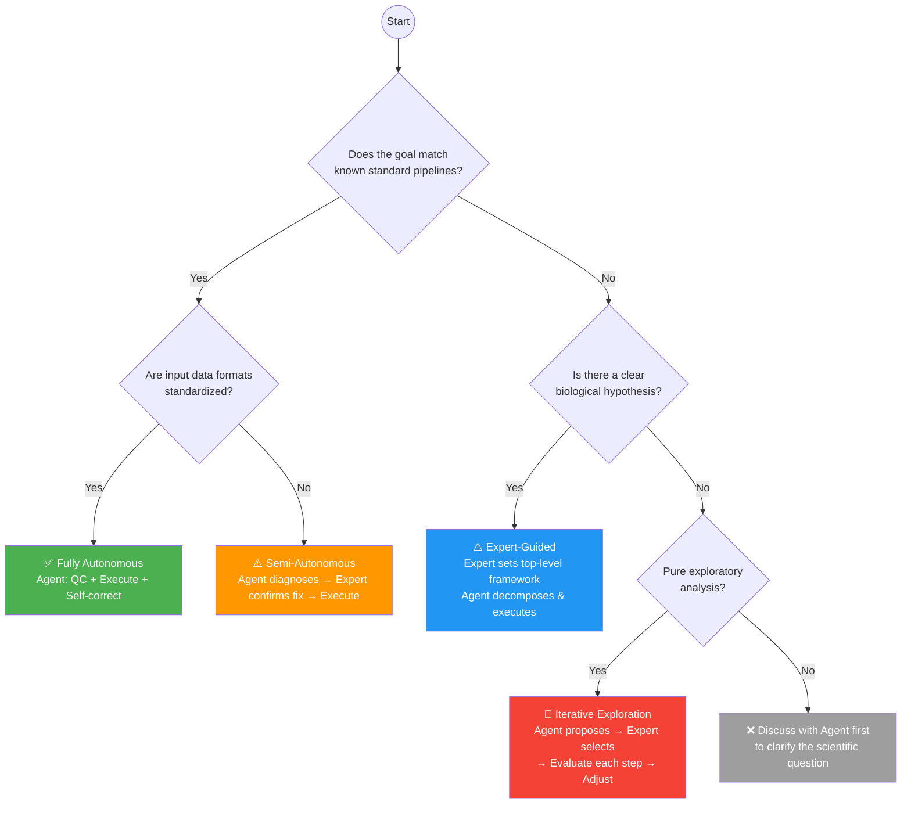

# 📘 TransMAgent User Guide: Autonomous Execution vs. Expert Guidance

> **Version**: v1.0  
> **Applicable to**: TransMAgent ≥ 1.0  
> **Purpose**: Help users determine when to use fully autonomous execution vs. when expert intervention is needed, maximizing both analytical efficiency and result reliability.

---

## 📖 Reading Guide

This document uses a **two-tier annotation system**. You can skip-read based on your background:

| Tag | Meaning | Target Audience |
|---|---|---|
| 🧬 | Conceptual Layer | Wet-lab biologists, users unfamiliar with command-line tools |
| ⚙️ | Technical Layer | Bioinformatics experts, users who want to deeply customize Pipelines |

> 💡 **Tip**: If you come from a wet-lab background, prioritize reading 🧬-tagged sections. You can skip ⚙️-tagged sections and still gain a complete understanding.

---

## Table of Contents

1. [Quick Decision Tree](#1-quick-decision-tree)
2. [Scenario Classification Matrix — Transcriptional Regulation](#2-scenario-classification-matrix--transcriptional-regulation)
3. [Four Types of Expert Intervention](#3-four-types-of-expert-intervention)
4. [Fully Autonomous Mode: Best Practices](#4-fully-autonomous-mode-best-practices)
5. [Hybrid Mode: Workflow Templates](#5-hybrid-mode-workflow-templates)
6. [FAQ & Edge Cases](#6-faq--edge-cases)

---

## 1. Quick Decision Tree

### 🧬 Basic Version (3 Questions)

Answer the following questions for your analytical task:

```
Q1: Is there a well-established standard pipeline for my analysis?
  ├─ Yes → Q2
  └─ No  → Q3

Q2: Is my data format standardized and my sample naming clear?
  ├─ Yes → ✅ [Fully Autonomous]
  │        Upload your data. Agent handles QC → Analysis → Report autonomously.
  └─ No  → ⚠️ [Semi-Autonomous]
            Agent diagnoses data issues → You confirm the fix → Agent executes.

Q3: Do I have a clear biological hypothesis?
  ├─ Yes → ⚠️ [Expert-Guided]
  │        You define the analytical direction → Agent decomposes & executes
  │        → Agent pauses at key checkpoints for your confirmation.
  └─ No  → 🔴 [Iterative Exploration]
            Agent proposes possible analysis paths → You select → Stepwise refinement.
```

### ⚙️ Enhanced Version (with Technical Details)



### Mode Quick Reference

| Mode | Indicator | Expert Effort | Agent Autonomy | Best For |
|---|---|---|---|---|
| Fully Autonomous | 🟢 | Zero | 100% | Standard pipelines, clean data |
| Semi-Autonomous | 🟡 | Key checkpoint only | 90% | Minor data issues, threshold tuning |
| Expert-Guided | 🔵 | Directional decisions | 70% | Custom analysis, multi-omics integration |
| Iterative Exploration | 🔴 | Per-step evaluation | 50% | Frontier exploration, no prior knowledge |

---

## 2. Scenario Classification Matrix — Transcriptional Regulation

This matrix is specifically scoped to **transcriptional regulation** studies, covering the full spectrum from transcription factor (TF) binding to target gene elucidation.

### 2.1 TF-DNA Binding Profiling

| Scenario | 🧬 Plain Description | ⚙️ Typical Toolchain | Recommended Mode | Expert Intervention Point |
|---|---|---|---|---|
| ChIP-seq Peak Calling | Where does a TF bind? | Bowtie2→MACS2→IDR | 🟡 Semi-Autonomous | Confirm q-value threshold; confirm IDR cutoff |
| CUT&RUN Peak Calling | Low-input TF binding map | Bowtie2→SEACR/MACS2 | 🟡 Semi-Autonomous | Confirm peak caller (SEACR vs. MACS2); IgG control strategy |
| CUT&Tag Profiling | Ultra-low-input TF binding | Bowtie2→SEACR | 🔵 Expert-Guided | Confirm spike-in normalization; confirm fragment size filtering |
| ChIP-exo / ChIP-nexus | Near-single-base resolution binding | Custom pipeline | 🔴 Iterative Exploration | Per-step evaluation; confirm exonuclease trimming parameters |
| Differential Binding Analysis | Does TF binding change between conditions? | DiffBind / MAnorm / DESeq2 | 🔵 Expert-Guided | Confirm normalization method; confirm consensus peak set strategy |

### 2.2 Chromatin Accessibility

| Scenario | 🧬 Plain Description | ⚙️ Typical Toolchain | Recommended Mode | Expert Intervention Point |
|---|---|---|---|---|
| ATAC-seq Peak Calling | Which chromatin regions are open? | Bowtie2→MACS2/Genrich | 🟡 Semi-Autonomous | Confirm nucleosome-free fragment size range; confirm peak caller |
| Differential Accessibility | Does chromatin opening change? | DiffBind / DESeq2 on count matrix | 🔵 Expert-Guided | Confirm normalization (CPM vs. RLE vs. TMM); batch correction |
| ATAC-seq Footprinting | Where exactly does TF bind within open regions? | HINT-ATAC / TOBIAS | 🔵 Expert-Guided | Confirm footprint depth threshold; confirm motif database |
| Single-cell ATAC-seq | Chromatin state per cell | Cell Ranger ATAC→Signac/ArchR | 🔵 Expert-Guided | Confirm clustering resolution; confirm gene activity scoring method |

### 2.3 Transcriptomic Readout

| Scenario | 🧬 Plain Description | ⚙️ Typical Toolchain | Recommended Mode | Expert Intervention Point |
|---|---|---|---|---|
| mRNA Differential Expression (Perturbation) | Which genes change upon TF knockdown/overexpression? | STAR→featureCounts→DESeq2 | 🟢 Fully Autonomous | Minimal; confirm comparison groups |
| Time-course RNA-seq | How does the transcriptional response unfold? | STAR→DESeq2 LRT / maSigPro | 🔵 Expert-Guided | Confirm time-course model (LRT vs. polynomial); confirm clustering method |
| RNA-seq with Spike-in | Absolute quantification of transcriptional output | STAR→featureCounts + spike-in normalization | 🔵 Expert-Guided | Confirm spike-in scaling factor; confirm spike-in vs. internal control strategy |
| Nascent RNA-seq (PRO-seq / GRO-seq) | Active transcription — where is Pol II engaged? | Custom → HOMER / groHMM | 🔴 Iterative Exploration | Confirm pause index thresholds; per-step evaluation |
| Single-cell RNA-seq (TF perturbation) | Cell-type-specific TF effects | Cell Ranger→Seurat/Scanpy | 🔵 Expert-Guided | Confirm clustering resolution; confirm cell-type annotation strategy |

### 2.4 Motif & Regulatory Sequence Analysis

| Scenario | 🧬 Plain Description | ⚙️ Typical Toolchain | Recommended Mode | Expert Intervention Point |
|---|---|---|---|---|
| *De novo* Motif Discovery | What DNA sequence does the TF recognize? | MEME-ChIP / STREME | 🟡 Semi-Autonomous | Confirm peak set (summit ± bp window); confirm motif width range |
| Known Motif Enrichment | Which known TF motifs are enriched in my peaks? | HOMER / AME | 🟢 Fully Autonomous | Minimal (default databases cover JASPAR/HOCOMOCO) |
| Motif Scanning & TFBS Prediction | Where are all predicted binding sites genome-wide? | FIMO / MAST (with PWM) | 🟡 Semi-Autonomous | Confirm p-value threshold; confirm motif database choice |
| Composite Motif Analysis | Do multiple TFs bind cooperatively? | SpaMo / MCAST | 🔴 Iterative Exploration | Confirm cooperative binding hypothesis; confirm distance constraints |

### 2.5 Regulatory Element Annotation

| Scenario | 🧬 Plain Description | ⚙️ Typical Toolchain | Recommended Mode | Expert Intervention Point |
|---|---|---|---|---|
| Peak-to-Gene Annotation | Which genes are near my TF peaks? | HOMER annotatePeaks / ChIPseeker | 🟢 Fully Autonomous | Confirm annotation window (±kb from TSS) |
| Enhancer Identification | Which peaks mark active enhancers? | H3K27ac + H3K4me1 overlap / GeneHancer | 🔵 Expert-Guided | Confirm histone mark combination; confirm tissue-specific enhancer databases |
| Super-enhancer Calling | Which loci have exceptionally dense TF/enhancer signal? | ROSE | 🟡 Semi-Autonomous | Confirm stitching distance; confirm signal threshold for super-enhancer classification |
| Promoter vs. Enhancer Classification | Is this peak a promoter or an enhancer? | ChromHMM / Segway | 🔵 Expert-Guided | Confirm chromatin state model; confirm number of states |

### 2.6 Regulatory Network Inference

| Scenario | 🧬 Plain Description | ⚙️ Typical Toolchain | Recommended Mode | Expert Intervention Point |
|---|---|---|---|---|
| TF → Target Gene Network | Which genes does my TF directly regulate? | ChIP-seq peaks ∩ DEGs | 🔵 Expert-Guided | Confirm integration strategy (direct overlap vs. correlation-weighted) |
| Gene Regulatory Network (GRN) | Global TF–target wiring from expression data | SCENIC / GENIE3 / ARACNe | 🔵 Expert-Guided | Confirm regulon size cutoff; confirm TF list (all vs. curated) |
| Dynamic Regulatory Networks | How does the network rewire across conditions? | DyNet / differential GRN | 🔴 Iterative Exploration | Confirm network comparison metric; confirm significance threshold |
| Enhancer–Promoter Linking | Which enhancers contact which promoters? | HiChIP / Hi-C + RNA-seq integration | 🔴 Iterative Exploration | Confirm loop calling resolution; confirm FDR threshold |

### 2.7 Multi-omics Integration for Transcriptional Regulation

| Scenario | 🧬 Plain Description | Recommended Mode | Expert Intervention Point |
|---|---|---|---|
| ChIP-seq + RNA-seq (TF Perturbation) | TF binding → target gene expression | 🔵 Expert-Guided | Confirm integration model (direct overlap vs. quantitative model) |
| ATAC-seq + RNA-seq | Chromatin opening → gene expression changes | 🔵 Expert-Guided | Confirm association window (±kb); confirm directionality modeling |
| ChIP-seq + ATAC-seq + RNA-seq | Full regulatory cascade: TF→chromatin→expression | 🔵 Expert-Guided | Confirm causal inference strategy; confirm multi-layer integration order |
| DNA Methylation + ChIP-seq | Does methylation affect TF binding? | 🔴 Iterative Exploration | Confirm methylation-aware motif scanning; confirm region overlap strategy |
| Hi-C/HiChIP + ChIP-seq + RNA-seq | 3D regulatory hubs controlling gene expression | 🔴 Iterative Exploration | Per-layer validation; confirm 3D contact significance threshold |

---

## 3. Four Types of Expert Intervention

TransMAgent proactively pauses and requests your decision in the following four situations. This is not a system limitation — it is an intentional design to ensure scientific rigor.

### 3.1 Strategy Fork Point 🍴

**Trigger**: Agent identifies ≥2 viable analytical strategies whose choice significantly affects downstream results.

**Scenario Examples**:

| 🧬 Plain Scenario | ⚙️ Technical Detail | Agent Query Example |
|---|---|---|
| Which differential expression method? | DESeq2 vs. edgeR vs. limma-voom | "Detected 3 differential expression methods. DESeq2 suits medium-to-large sample sizes, edgeR is more robust for small samples, limma-voom suits continuous variables. Your data: n=6/group. Recommendation: DESeq2. Confirm?" |
| How to handle batch effects? | ComBat vs. RUVSeq vs. Harman | "Clear batch effect detected. Recommendation: ComBat (strong biological variability preservation). Alternative: RUVSeq (requires negative control genes). Please choose." |
| Which enrichment database? | GO vs. KEGG vs. Reactome vs. Hallmark | "Recommendation: use both GO (broad coverage) and Hallmark (clear biological interpretability). Confirm?" |

**Agent Behavior**: Lists candidate strategies → annotates suitable scenarios and pros/cons → **halts, awaiting user selection**.

---

### 3.2 Threshold Decision Point 🎚️

**Trigger**: A parameter choice significantly affects result quantity or quality.

**Scenario Examples**:

| 🧬 Plain Scenario | ⚙️ Technical Detail | Agent Query Example |
|---|---|---|
| How stringent should peak calling be? | ChIP-seq q-value: 0.01 vs. 0.05 | "Current data: q<0.05 → 12,345 peaks; q<0.01 → 8,901 peaks (28% reduction). Recommendation: q<0.05 (exploratory) or q<0.01 (validation). Please choose." |
| Fold-change cutoff for DEGs? | log2FC: 0.5 vs. 1.0 vs. none | "log2FC≥0.5 → 2,103 genes; ≥1.0 → 543 genes. Recommendation: ≥0.5 (filtered downstream by enrichment). Confirm?" |
| Motif scanning stringency? | FIMO p-value: 1e-4 vs. 1e-5 | "At p<1e-4, 45,000 binding sites predicted; at p<1e-5, 12,000 sites. Recommendation: p<1e-4 for initial screen, then filter by conservation. Choose?" |

**Agent Behavior**: Provides visual preview of parameter impact (count comparison) → **halts and waits**.

---

### 3.3 Anomaly / Boundary Detection Point ⚠️

**Trigger**: A quality metric or result falls outside the typical range and may affect conclusions.

**Scenario Examples**:

| 🧬 Plain Scenario | ⚙️ Technical Detail | Agent Query Example |
|---|---|---|
| Sample quality failure | Duplication Rate > 80% | "Sample B3 duplication rate: 85% (normal < 30%). Likely low library complexity. Options: ① Exclude sample ② Analyze separately with annotation ③ Proceed anyway. Please choose." |
| Abnormally low mapping rate | Mapping Rate < 50% | "Sample C2 mapping rate: 38% (normal > 70%). Possible causes: contamination, species mismatch, adapter not trimmed. Recommendation: run contamination screening first. Proceed?" |
| Peak count explosion | >100,000 peaks | "Detected 120,000 peaks (expected 5,000–50,000 for typical TF ChIP). Possible causes: insufficient input control, overly permissive threshold, or genuine broad-binding factor. Recommendation: inspect IDR results first. View?" |

**Agent Behavior**: Delivers diagnostic report → lists possible causes → provides handling options → **halts and waits**.

---

### 3.4 Direction Confirmation Point 🧭

**Trigger**: A phased analysis stage is complete and multiple valid downstream paths exist.

**Scenario Examples**:

| 🧬 Plain Scenario | Current Completion | Agent Query Example |
|---|---|---|
| Found DEGs — what next? | Differential analysis (543 DEGs) | "Differential analysis complete. Downstream options: ① GO/KEGG enrichment ② Protein–protein interaction network ③ TF target prediction ④ Machine learning feature selection. Recommendation: start with enrichment. Choose." |
| Peaks called — how to interpret? | Peak calling (8,234 peaks) | "Peak calling complete. Downstream options: ① Peak-to-gene annotation ② Motif discovery ③ Differential binding analysis ④ Super-enhancer identification. Recommendation: annotate first. Choose." |
| TF targets identified — deeper analysis? | TF→target list (287 genes) | "287 direct target genes identified. Downstream options: ① Motif enrichment in target promoters ② Regulatory network visualization ③ Integration with public ChIP data (ENCODE) ④ Survival analysis (if clinical data available). Choose." |

**Agent Behavior**: Displays completed result summary → lists downstream menu (with recommendations) → **halts and waits**.

---

## 4. Fully Autonomous Mode: Best Practices

### 4.1 🧬 When Can You Trust Fully Autonomous Mode?

Fully Autonomous mode is most reliable when **all** of the following conditions are met:

- [x] Data is in standard formats (FASTQ / BAM / expression matrix)
- [x] The analysis goal maps to a well-established pipeline (e.g., ChIP-seq peak calling, RNA-seq differential expression)
- [x] Sample naming is consistent (e.g., `WT_rep1`, `KO_rep1`) with clear grouping
- [x] Sample size ≥ 3 replicates per group
- [x] No special experimental design (e.g., time series, dose gradients)
- [x] You have no strong preference for non-default parameters

### 4.2 ⚙️ Technical Safeguards in Autonomous Mode

TransMAgent automatically performs the following checks and self-corrections in Autonomous mode:

| Check | Automatic Handling |
|---|---|
| Input file integrity | Auto-detects md5/file size; alerts on anomaly |
| Tool dependency check | Auto-installs missing packages/conda environments |
| Reference genome matching | Auto-detects species and loads correct reference |
| Parameter rationality | Auto-adjusts based on data characteristics (e.g., read length → alignment parameters) |
| Intermediate result validation | Auto-checks output file integrity after each step |
| Failure retry | Detects failures → analyzes error logs → adjusts parameters → auto-retries (max 3 attempts) |

### 4.3 🧬 Fully Autonomous Mode — Example

```
All you need to provide:
  📁 /data/chipseq/   (FASTQ files)
  📋 sample_info.csv  (sample grouping table)

Agent autonomously completes:
  ✅ FastQC quality assessment
  ✅ Trim Galore adapter trimming
  ✅ Bowtie2 alignment
  ✅ MACS2 peak calling
  ✅ IDR reproducibility analysis
  ✅ HOMER peak annotation & motif analysis
  ✅ Auto-generated PDF report

Zero manual intervention required. Results ready in ~2–4 hours.
```

### 4.4 Data Preparation Checklist

> 🔑 **This is critical for Autonomous mode success**. Please ensure:

**Sample information table (sample_info.csv) MUST include**:

| Column | 🧬 Meaning | Example |
|---|---|---|
| `sample_id` | Unique sample identifier | `WT_ChIP_rep1` |
| `group` | Group assignment | `Control` / `TF_KD` |
| `antibody` | Target (for ChIP/CUT&RUN) | `H3K27ac` / `TF-X` / `Input` |
| `file_R1` | R1 file path | `/data/WT_ChIP_rep1_R1.fq.gz` |
| `file_R2` | R2 file path (PE sequencing) | `/data/WT_ChIP_rep1_R2.fq.gz` |

> ⚠️ For ChIP-seq specifically, ensure your `group` column distinguishes between IP samples and Input/IgG controls. Agent will automatically pair IP with the corresponding control.

---

## 5. Hybrid Mode: Workflow Templates

### 5.1 🧬 "Expert Sets Direction, Agent Does the Work" — Recommended Flow

This is TransMAgent's most powerful usage mode, combining expert judgment with execution efficiency:

```
┌──────────────────────────────────────────────────────────────┐
│  Phase                Lead         Content          Time     │
├──────────────────────────────────────────────────────────────┤
│ ① Scientific Question  Expert 🧑‍🔬  Describe biology   5 min  │
│    & Data Upload                   Upload data               │
├──────────────────────────────────────────────────────────────┤
│ ② Analytical Blueprint Agent 🤖   Propose pipeline    2 min  │
│                                    Tool selection            │
├──────────────────────────────────────────────────────────────┤
│ ③ Blueprint Approval   Expert 🧑‍🔬  Review / modify     5 min  │
│                                    One-time full approval    │
├──────────────────────────────────────────────────────────────┤
│ ④ Autonomous Execution Agent 🤖   Pipeline runs       2–8 h  │
│                                    Auto-correct / logging    │
│                                    (Pauses only at 4         │
│                                     intervention triggers)   │
├──────────────────────────────────────────────────────────────┤
│ ⑤ Result Review        Expert 🧑‍🔬  Inspect key outputs 10 min │
│                                    Decide: continue /        │
│                                    adjust / terminate        │
├──────────────────────────────────────────────────────────────┤
│ ⑥ Iteration            Loop ④–⑤   Proceed to next      As    │
│                                    analysis round      needed │
└──────────────────────────────────────────────────────────────┘
```

### 5.2 Complete Walkthrough: TF-X Regulatory Network Discovery

**Biological question**: Which target genes does transcription factor TF-X directly regulate in hepatocellular carcinoma?

#### Phase 1: Expert Definition (You provide)

```
🧬 I am studying transcription factor TF-X in liver cancer.
I have two datasets:
  - ChIP-seq: TF-X binding in HepG2 cells (2 replicates/group, 4 total samples:
    2 TF-X IP, 2 Input)
  - RNA-seq: TF-X knockdown vs. control (3 replicates/group, 6 total samples)
  
I want to know which genes TF-X directly regulates and what pathways
these target genes are involved in.
Reference genome: hg38
```

#### Phase 2: Agent Proposes Blueprint

```
🤖 Analytical blueprint:

[ChIP-seq Branch]
  FastQC → Bowtie2 alignment → MACS2 peak calling → IDR
  → HOMER peak annotation → De novo motif discovery

[RNA-seq Branch]
  FastQC → STAR alignment → featureCounts quantification
  → DESeq2 differential expression

[Integration]
  ChIP peaks (±5kb) ∩ RNA-seq DEGs → TF-X direct target genes
  → GO/KEGG enrichment → Regulatory network visualization
  → Motif enrichment in target gene promoters

Estimated runtime: ~4–6 hours
```

#### Phase 3: Expert Approval

```
🧬 Looks reasonable. Two adjustments:
  1. Peak calling q-value: use 0.01 (more stringent for integration)
  2. Peak-to-gene annotation window: use ±10kb instead of ±2kb,
     because TF-X is known to bind distal regulatory elements

🤖 Noted. Adjusted: q<0.01, annotation window ±10kb. Starting execution.
```

#### Phase 4: Autonomous Execution (with one intervention)

```
🤖 [Progress 45%] ChIP-seq IDR analysis warning:
  Sample KD_rep3 FRiP: 2.1% (normal > 5%).
  This sample has low signal-to-noise ratio.
  Recommendation: exclude KD_rep3 and proceed with 1 remaining replicate +
  pooled analysis. Proceed?
  
🧬 Agreed, exclude KD_rep3.

🤖 [Adjusted] Continuing... (no further attention needed)
```

#### Phase 5: Result Review

```
🤖 [Complete] Analysis Results:
  • TF-X binding peaks: 8,234 (IDR-passed)
  • Differential genes: 1,456 (832 up, 624 down in KD)
  • TF-X direct target genes: 287
  • Enriched pathways: Wnt signaling, cell cycle, fatty acid metabolism
  • Top enriched motif: matches TF-X known motif (p=1e-234)
  
  Downstream options:
  ① Compare with public ChIP-seq data (ENCODE HepG2)
  ② TF-X regulon network visualization
  ③ Survival analysis of target genes (if clinical data available)
  ④ Generate final report

🧬 Do motif comparison with paralog TFs, then generate report.
```

### 5.3 ⚙️ Variant: Batch Task Mode

When you need to apply the same analysis to multiple datasets:

```
🧬 I have 6 ChIP-seq experiments (different TFs, all in the same cell line).
   I want to run the same peak calling + motif analysis for each.

🤖 Identified as batch task.
   Strategy: run TF-A first to confirm parameters → expert approval → 
   batch execute the remaining 5.
   
   Results:
   ✅ TF-A: Complete (12,345 peaks, motif: ETS-family)
   ✅ TF-B: Complete (8,901 peaks, motif: bZIP-family)
   ✅ TF-C: Complete (5,678 peaks, motif: bHLH-family)
   ⚠️ TF-D: Low quality — 234 peaks (FRiP=1.8%). Paused for review.
   ✅ TF-E: Complete (10,234 peaks, motif: FOX-family)
   ✅ TF-F: Complete (9,012 peaks, motif: nuclear receptor)
```

---

## 6. FAQ & Edge Cases

### 6.1 🧬 Frequently Asked Questions

**Q1: I don't know what analysis my data needs. What do I do?**

> Simply tell the Agent your biological question and data type. For example: "I have 4 ChIP-seq samples for TF-X with matched Input controls — I want to find its binding sites and target genes." The Agent will automatically recommend and build an analysis plan.

**Q2: Can I trust the results from Fully Autonomous mode?**

> TransMAgent uses the exact same tools and parameters as a human analyst for core workflows (alignment, peak calling, differential expression). All intermediate logs are fully preserved for verification. However, for threshold-sensitive decisions, the system uses conservative defaults. We recommend reviewing results after the first run.

**Q3: What if I want to change direction mid-analysis?**

> Anytime. At any pause point (including during Autonomous mode, by sending a message), you can give new instructions. The Agent will dynamically adjust the downstream workflow.

**Q4: Could the Agent make wrong analytical choices?**

> The Agent makes default choices based on domain best practices. If you are uncertain about a decision, switch to Expert-Guided mode to review each step. All critical-step logs are fully traceable and reproducible.

---

### 6.2 ⚙️ Edge Cases: Gray Zones in Mode Selection

| Scenario | Ambiguity | Recommended Approach |
|---|---|---|
| Standard pipeline, non-default parameters | Auto vs. Semi-Auto | Run Auto with defaults first → inspect results → re-run with adjusted parameters |
| Novel assay (no standard pipeline) | Expert-Guided vs. Iterative Exploration | Discuss possible strategies with Agent first, then choose path |
| Large-scale public data re-analysis | Auto vs. Batch | Manually run 1–2 samples to confirm → batch mode for the rest |
| Methodological comparison study | Expert-Guided | Expert MUST define comparison methods and evaluation criteria |
| Non-standard data + novice user | High risk | Consult a domain expert to define the analytical framework first, then use Agent for execution |

---

### 6.3 Diagnostic Tool: Auto-Suitability Score

TransMAgent provides an **"Auto-Suitability Score"** function: after you upload your data, the Agent automatically evaluates and outputs a score (0–100) to help you anticipate complexity.

```
🤖 Auto-Diagnostic Report:
  
  Data type: ChIP-seq (PE150, TF ChIP + Input, 8 samples)
  Format:    ✅ FASTQ naming standard
  Metadata:  ✅ sample_info.csv — groups and antibodies clearly specified
  Design:    ✅ 2 conditions, 2 IP replicates + 2 Input each
  Reference: ✅ hg38 available in system
  
  Auto-Suitability Score: 90/100 🟢
  Risk Flags: None
  Recommended Mode: Fully Autonomous
```

```
🤖 Auto-Diagnostic Report:

  Data type: CUT&Tag (SE50, histone mark, 6 samples)
  Format:    ⚠️ File names contain non-ASCII characters
  Metadata:  ❌ No Input/IgG control specified
  Design:    ❓ Control strategy unclear (spike-in? IgG?)
  Reference: ✅ mm10 available in system

  Auto-Suitability Score: 48/100 🟡
  Risk Flags:
    • Please specify control strategy (IgG / spike-in / none)
    • Recommend renaming files to ASCII
  Recommended Mode: Semi-Autonomous (expert confirms control strategy first)
```

---

### 6.4 Glossary

| 🧬 Plain Term | ⚙️ Technical Term | Brief Explanation |
|---|---|---|
| Quality check | QC (FastQC) | Assess whether sequencing data quality is acceptable |
| Adapter trimming | Adapter Trimming | Remove artificial adapter sequences from reads |
| Alignment / Mapping | Alignment / Mapping | Position sequencing reads onto the reference genome |
| Peak calling | Peak Calling | Identify regions where protein (TF/histone) is enriched over background |
| IDR | Irreproducible Reproducibility Rate | Consistency check across biological replicates |
| Differential expression | Differential Expression (DEG) | Compare gene expression changes between conditions |
| Differential binding | Differential Binding (DB) | Compare TF binding changes between conditions |
| Motif discovery | *De novo* Motif Discovery | Identify the DNA sequence pattern recognized by a TF |
| Motif enrichment | Known Motif Enrichment | Test if known TF binding motifs are over-represented in peak regions |
| Functional enrichment | GO/KEGG Enrichment | Identify biological processes/pathways enriched in a gene list |
| FRiP | Fraction of Reads in Peaks | Proportion of reads falling within called peaks — signal-to-noise metric |
| Batch effect | Batch Effect | Non-biological variation between samples processed at different times |
| Normalization | Normalization | Remove technical biases (e.g., sequencing depth differences) |
| Regulon | Regulon | The set of target genes regulated by a single TF |

---

## 📎 Appendix: Companion Resources

| Resource | Link | Description |
|---|---|---|
| Dynamic Visualization Site | [http://www.licpathway.net/transmagent/] | Visualize expert intervention timing and rationale across cases |

---

> **Summary**: TransMAgent's design philosophy is — **let experts focus on strategic decisions; let the Agent handle tactical execution**. By selecting the right mode, you gain both expert-level judgment and agent-level efficiency.
