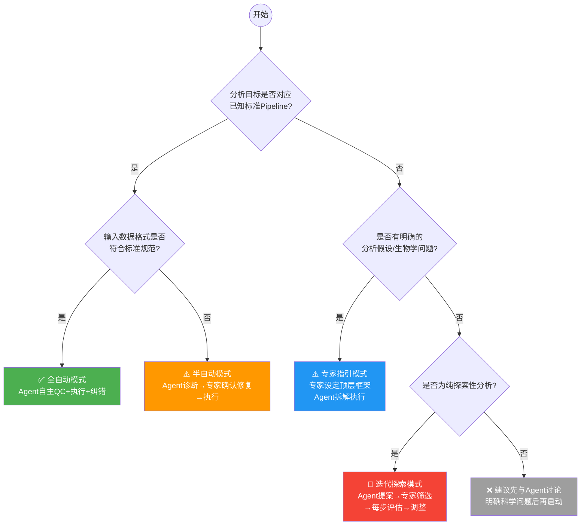

# 📘 TransMAgent 使用指南：自主执行 vs 专家指引

> **版本**: v1.0  
> **适用版本**: TransMAgent ≥ 1.0  
> **文档定位**: 帮助用户判断"何时适合全自动运行"与"何时需要专家介入"，最大化分析效率与结果可靠性。

---

## 📖 阅读指南

本文档采用**双层次标注**，您可根据自身背景跳读：

| 标注 | 含义 | 适合人群 |
|---|---|---|
| 🧬 | 基础概念层 | 湿实验生物学家、不熟悉命令行的用户 |
| ⚙️ | 技术细节层 | 生信专家、希望深入定制Pipeline的用户 |

> 💡 **建议**: 如果您是湿实验背景，请优先阅读 🧬 标记段落，跳过 ⚙️ 标记段落即可获得完整理解。

---

## 目录

1. [快速决策树](#1-快速决策树)
2. [场景分类矩阵](#2-场景分类矩阵)
3. [专家介入的四种时机](#3-专家介入的四种时机)
4. [全自动模式最佳实践](#4-全自动模式最佳实践)
5. [混合模式工作流模板](#5-混合模式工作流模板)
6. [FAQ & 边界案例](#6-faq--边界案例)

---

## 1. 快速决策树

### 🧬 基础版（3 个问题）

面对您的分析任务，请依次回答以下问题：

```
问1：我的分析是否有公认的标准流程？
  ├─ 是 → 问2
  └─ 否 → 问3

问2：我的数据格式规范、样本命名清晰吗？
  ├─ 是 → ✅【全自动模式】
  │        直接上传数据，Agent 自主完成 QC→分析→报告
  └─ 否 → ⚠️【半自动模式】
            Agent 诊断数据问题 → 您确认修复方案 → Agent 执行

问3：我是否有明确的生物学假设？
  ├─ 是 → ⚠️【专家指引模式】
  │        您定义分析方向 → Agent 拆解执行 → 关键节点请您确认
  └─ 否 → 🔴【迭代探索模式】
            Agent 提案可能的分析路径 → 您选择 → 逐步推进
```

### ⚙️ 增强版（含技术细节）



### 各模式速查

| 模式 | 图标 | 专家工作量 | Agent 自主度 | 适用场景 |
|---|---|---|---|---|
| 全自动 | 🟢 | 零介入 | 100% | 标准Pipeline，数据规范 |
| 半自动 | 🟡 | 关键节点确认 | 90% | 数据有小瑕疵，阈值需确认 |
| 专家指引 | 🔵 | 方向性决策 | 70% | 定制化分析，多组学整合 |
| 迭代探索 | 🔴 | 每步评估 | 50% | 前沿探索，无先验知识 |

---

## 2. 场景分类矩阵 — 转录调控领域

本矩阵聚焦于**转录调控**研究，覆盖从转录因子（TF）结合到靶基因阐明的完整分析链路。

### 2.1 TF-DNA 结合谱分析

| 分析场景 | 🧬 通俗描述 | ⚙️ 典型工具链 | 推荐模式 | 专家介入点 |
|---|---|---|---|---|
| ChIP-seq 峰检测 | 转录因子结合在哪里？ | Bowtie2→MACS2→IDR | 🟡 半自动 | 确认 q-value 阈值；确认 IDR 截断标准 |
| CUT&RUN 峰检测 | 低起始量 TF 结合图谱 | Bowtie2→SEACR/MACS2 | 🟡 半自动 | 确认峰调用工具（SEACR vs. MACS2）；IgG 对照策略 |
| CUT&Tag 分析 | 超低起始量 TF 结合 | Bowtie2→SEACR | 🔵 专家指引 | 确认 spike-in 归一化；确认片段大小过滤 |
| ChIP-exo / ChIP-nexus | 近单碱基分辨率结合位点 | 定制流程 | 🔴 迭代探索 | 每步评估；确认外切酶修剪参数 |
| 差异结合分析 | TF 结合在不同条件间是否变化？ | DiffBind / MAnorm / DESeq2 | 🔵 专家指引 | 确认归一化方法；确认共有峰集策略 |

### 2.2 染色质可及性

| 分析场景 | 🧬 通俗描述 | ⚙️ 典型工具链 | 推荐模式 | 专家介入点 |
|---|---|---|---|---|
| ATAC-seq 峰检测 | 哪些染色质区域是开放的？ | Bowtie2→MACS2/Genrich | 🟡 半自动 | 确认无核小体片段大小范围；确认峰调用工具 |
| 差异可及性分析 | 染色质开放程度是否变化？ | DiffBind / DESeq2 计数矩阵 | 🔵 专家指引 | 确认归一化方式（CPM vs. RLE vs. TMM）；批次校正 |
| ATAC-seq 足迹分析 | TF 在开放区域内的精确结合位置？ | HINT-ATAC / TOBIAS | 🔵 专家指引 | 确认足迹深度阈值；确认 motif 数据库 |
| 单细胞 ATAC-seq | 每个细胞的染色质状态 | Cell Ranger ATAC→Signac/ArchR | 🔵 专家指引 | 确认聚类分辨率；确认基因活性评分方法 |

### 2.3 转录组读出

| 分析场景 | 🧬 通俗描述 | ⚙️ 典型工具链 | 推荐模式 | 专家介入点 |
|---|---|---|---|---|
| mRNA 差异表达（扰动） | TF 敲低/过表达后哪些基因变化？ | STAR→featureCounts→DESeq2 | 🟢 全自动 | 基本无需介入；确认比较组即可 |
| 时序 RNA-seq | 转录响应如何随时间展开？ | STAR→DESeq2 LRT / maSigPro | 🔵 专家指引 | 确认时序模型（LRT vs. 多项式）；确认聚类方法 |
| Spike-in RNA-seq | 转录输出的绝对定量 | STAR→featureCounts + spike-in 归一化 | 🔵 专家指引 | 确认 spike-in 缩放因子；确认 spike-in vs. 内参策略 |
| 新生 RNA-seq（PRO-seq / GRO-seq） | 活跃转录——Pol II 在何处结合？ | 定制 → HOMER / groHMM | 🔴 迭代探索 | 确认暂停指数阈值；每步评估 |
| 单细胞 RNA-seq（TF 扰动） | 细胞类型特异性 TF 效应 | Cell Ranger→Seurat/Scanpy | 🔵 专家指引 | 确认聚类分辨率；确认细胞类型注释策略 |

### 2.4 Motif 与调控序列分析

| 分析场景 | 🧬 通俗描述 | ⚙️ 典型工具链 | 推荐模式 | 专家介入点 |
|---|---|---|---|---|
| *De novo* Motif 发现 | TF 识别什么 DNA 序列？ | MEME-ChIP / STREME | 🟡 半自动 | 确认输入峰集（summit ± bp 窗口）；确认 motif 宽度范围 |
| 已知 Motif 富集 | 哪些已知 TF motif 在我的峰中富集？ | HOMER / AME | 🟢 全自动 | 基本无需介入（默认数据库覆盖 JASPAR/HOCOMOCO） |
| Motif 扫描与 TFBS 预测 | 全基因组范围预测所有结合位点？ | FIMO / MAST（使用 PWM） | 🟡 半自动 | 确认 p 值阈值；确认 motif 数据库选择 |
| 复合 Motif 分析 | 多个 TF 是否协同结合？ | SpaMo / MCAST | 🔴 迭代探索 | 确认协同结合假说；确认间距约束条件 |

### 2.5 调控元件注释

| 分析场景 | 🧬 通俗描述 | ⚙️ 典型工具链 | 推荐模式 | 专家介入点 |
|---|---|---|---|---|
| 峰到基因注释 | 我的 TF 峰邻近哪些基因？ | HOMER annotatePeaks / ChIPseeker | 🟢 全自动 | 确认注释窗口（TSS ± kb） |
| 增强子鉴定 | 哪些峰标记活跃增强子？ | H3K27ac + H3K4me1 重叠 / GeneHancer | 🔵 专家指引 | 确认组蛋白修饰组合；确认组织特异性增强子数据库 |
| 超级增强子鉴定 | 哪些位点有异常密集的 TF/增强子信号？ | ROSE | 🟡 半自动 | 确认缝合距离；确认超级增强子分类的信号阈值 |
| 启动子 vs. 增强子分类 | 这个峰是启动子还是增强子？ | ChromHMM / Segway | 🔵 专家指引 | 确认染色质状态模型；确认状态数量 |

### 2.6 调控网络推断

| 分析场景 | 🧬 通俗描述 | ⚙️ 典型工具链 | 推荐模式 | 专家介入点 |
|---|---|---|---|---|
| TF → 靶基因网络 | 我的 TF 直接调控哪些基因？ | ChIP-seq peaks ∩ DEGs | 🔵 专家指引 | 确认整合策略（直接重叠 vs. 相关性加权） |
| 基因调控网络（GRN） | 从表达数据推断全局 TF–靶标关系 | SCENIC / GENIE3 / ARACNe | 🔵 专家指引 | 确认 regulon 大小截断；确认 TF 列表（全部 vs. 精选） |
| 动态调控网络 | 网络在不同条件下如何重塑？ | DyNet / 差异 GRN | 🔴 迭代探索 | 确认网络比较指标；确认显著性阈值 |
| 增强子–启动子连接 | 哪些增强子接触哪些启动子？ | HiChIP / Hi-C + RNA-seq 整合 | 🔴 迭代探索 | 确认 loop calling 分辨率；确认 FDR 阈值 |

### 2.7 转录调控多组学整合

| 分析场景 | 🧬 通俗描述 | 推荐模式 | 专家介入点 |
|---|---|---|---|
| ChIP-seq + RNA-seq（TF 扰动） | TF 结合 → 靶基因表达 | 🔵 专家指引 | 确认整合模型（直接重叠 vs. 定量模型） |
| ATAC-seq + RNA-seq | 染色质开放 → 基因表达变化 | 🔵 专家指引 | 确认关联窗口（±kb）；确认方向性建模 |
| ChIP-seq + ATAC-seq + RNA-seq | 完整调控级联：TF→染色质→表达 | 🔵 专家指引 | 确认因果推断策略；确认多层整合顺序 |
| DNA 甲基化 + ChIP-seq | 甲基化是否影响 TF 结合？ | 🔴 迭代探索 | 确认甲基化感知 motif 扫描；确认区域重叠策略 |
| Hi-C/HiChIP + ChIP-seq + RNA-seq | 3D 调控中枢控制基因表达 | 🔴 迭代探索 | 逐层验证；确认 3D 接触显著性阈值 |

---

## 3. 专家介入的四种时机

TransMAgent 会在以下四种情况下**主动暂停**并请求您的决策。这并非系统局限，而是保障科学严谨性的设计。

### 3.1 方案分叉点 🍴

**触发条件**: Agent 识别到 ≥2 种可行分析策略，且选择将显著影响后续结果。

**示例场景**:

| 🧬 通俗场景 | ⚙️ 技术细节 | Agent 提问示例 |
|---|---|---|
| 差异基因用什么方法找？ | DESeq2 vs edgeR vs limma-voom | "检测到 3 种差异分析方法。DESeq2 适合中等到大样本量，edgeR 对小样本更稳健，limma-voom 适合连续变量。您的数据：n=6/组，建议 DESeq2。是否确认？" |
| 批次效应怎么处理？ | ComBat vs RUVSeq vs Harman | "检测到明显的批次效应。建议使用 ComBat（保留生物学差异能力强）。备选：RUVSeq（需要阴性对照基因）。请选择。" |
| 功能富集用哪个数据库？ | GO vs KEGG vs Reactome vs Hallmark | "建议同时使用 GO（覆盖面广）和 Hallmark（生物学意义清晰）。是否确认？" |

**Agent 行为**: 列出候选方案 → 标注适用场景和优缺点 → **停止等待用户选择**。

---

### 3.2 阈值决策点 🎚️

**触发条件**: 参数选择对结果数量/质量有显著影响。

**示例场景**:

| 🧬 通俗场景 | ⚙️ 技术细节 | Agent 提问示例 |
|---|---|---|
| Peak 多可靠才算？ | ChIP-seq q-value: 0.01 vs 0.05 | "当前数据在 q<0.05 时有 12,345 个 peak，q<0.01 时为 8,901 个（减少 28%）。建议使用 q<0.05（适合探索分析）或 q<0.01（适合验证分析）。请选择。" |
| 差异基因的倍数变化门槛？ | log2FC: 0.5 vs 1.0 vs 无过滤 | "log2FC≥0.5 得到 2,103 个基因，≥1.0 得到 543 个。建议使用 ≥0.5（后用功能富集过滤）。是否确认？" |
| 聚类分几群？ | 单细胞分辨率: 0.4 vs 0.8 vs 1.2 | "聚类结果预览如图。分辨率 0.6 时得到 12 个簇，0.8 时得到 18 个。请选择或输入自定义值。" |

**Agent 行为**: 提供参数影响的可视化预览（数量对比/聚类图） → **停止等待**。

---

### 3.3 异常/边界检测点 ⚠️

**触发条件**: 数据质量指标或分析结果超出常规范围，可能影响结论。

**示例场景**:

| 🧬 通俗场景 | ⚙️ 技术细节 | Agent 提问示例 |
|---|---|---|
| 某个样本质量太差 | Duplication Rate > 80% | "样本 B3 的 duplication rate 达 85%（正常<30%），可能因文库复杂度不足。建议：①剔除该样本 ②单独分析并标注 ③继续使用。请选择。" |
| 比对率异常低 | Mapping Rate < 50% | "样本 C2 的比对率仅 38%（正常>70%）。可能原因：污染、物种不匹配、接头未去除。建议先进行污染筛查。是否继续？" |
| 差异基因数量暴增 | >10,000 DEGs | "检测到 12,450 个差异基因（占总数 62%），超出正常范围。可能原因：批次效应未校正或阈值过宽。建议先检查 PCA 图。是否查看？" |

**Agent 行为**: 提供诊断报告 → 列出可能原因 → 给出处理选项 → **停止等待**。

---

### 3.4 方向确认点 🧭

**触发条件**: 阶段性分析完成，下游存在多条可行路径。

**示例场景**:

| 🧬 通俗场景 | 当前已完成 | Agent 提问示例 |
|---|---|---|
| 找到差异基因后干什么？ | 差异分析（543个DEGs） | "差异分析完成。下游可选：①功能富集分析（GO/KEGG）②蛋白质互作网络 ③转录因子靶标预测 ④机器学习特征筛选。建议优先做功能富集。请选择。" |
| ChIP-seq peak 找到了怎么用？ | Peak Calling（峰值列表） | "Peak 分析完成。下游可选：①peak注释（邻近基因）②motif分析 ③差异结合分析 ④超级增强子鉴定。请选择。" |
| 单细胞分群后怎么办？ | 聚类完成（12个簇） | "聚类完成。下游可选：①自动注释细胞类型 ②找marker基因 ③轨迹推断 ④细胞通讯分析。建议优先注释。请选择。" |

**Agent 行为**: 展示已完成结果摘要 → 列出下游路径菜单（标注推荐） → **停止等待**。

---

## 4. 全自动模式最佳实践

### 4.1 🧬 什么情况下可以放心全自动？

满足以下**所有条件**时，全自动模式的可靠性最高：

- [x] 数据是 FASTQ / BAM / 表达矩阵等标准格式
- [x] 分析目标对应公认 Pipeline（如 RNA-seq 差异分析）
- [x] 样本命名规范（如 `WT_rep1`, `KO_rep1`），分组清晰
- [x] 样本量 ≥ 3/组
- [x] 无特殊实验设计（如时间序列、剂量梯度）
- [x] 您对默认参数无特殊偏好

### 4.2 ⚙️ 全自动模式的技术保障

TransMAgent 在全自动模式下会自动执行以下检查与纠错：

| 检查项 | 自动处理策略 |
|---|---|
| 输入文件完整性 | 自动检测 md5/文件大小，异常则告警 |
| 工具依赖检查 | 自动安装缺失的软件包/conda 环境 |
| 参考基因组匹配 | 自动检测物种并加载对应参考文件 |
| 参数合理性 | 基于数据特征自动调整（如根据读长调整比对参数） |
| 中间结果校验 | 每步完成后自动检查输出文件完整性 |
| 失败重试 | 检测到运行失败 → 分析错误日志 → 调整参数 → 自动重试（最多3次） |

### 4.3 🧬 全自动模式使用示例

```
您只需提供：
  📁 /data/rnaseq/  （FASTQ 文件）
  📋 sample_info.csv （样本分组表）
  
Agent 自动完成：
  ✅ FastQC 质量评估
  ✅ Trim Galore 去接头
  ✅ STAR 比对
  ✅ featureCounts 定量
  ✅ DESeq2 差异分析
  ✅ 自动生成 PDF 报告

全程无需任何操作，约 2-4 小时后查看结果。
```

### 4.4 数据准备清单

> 🔑 **这是全自动模式成功的关键**。请确保：

**样本信息表 (sample_info.csv) 必须包含**:

| 列名 | 🧬 含义 | 示例 |
|---|---|---|
| `sample_id` | 样本唯一标识 | `WT_rep1` |
| `group` | 分组信息 | `Control` / `Treatment` |
| `file_R1` | R1 文件路径 | `/data/WT_rep1_R1.fq.gz` |
| `file_R2` | R2 文件路径（双端测序） | `/data/WT_rep1_R2.fq.gz` |

> ⚠️ 如果您的样本信息表格式不同，Agent 会自动进入半自动模式，请您辅助映射列名。

---

## 5. 混合模式工作流模板

### 5.1 🧬 "专家定方向，Agent 干活" — 推荐流程

这是 TransMAgent 最强大的使用模式，兼顾专家判断与执行效率：

```
┌─────────────────────────────────────────────────────────┐
│  阶段          主导者      内容               时间      │
├─────────────────────────────────────────────────────────┤
│ ① 科学问题定义  专家 🧑‍🔬   描述生物学问题      5 min    │
│    与数据确认              上传数据                      │
├─────────────────────────────────────────────────────────┤
│ ② 分析框架设计  Agent 🤖  提出分析蓝图         2 min    │
│                           工具选型方案                   │
├─────────────────────────────────────────────────────────┤
│ ③ 方案审批      专家 🧑‍🔬   审核/修改蓝图       5 min    │
│                           一次性确认全部                 │
├─────────────────────────────────────────────────────────┤
│ ④ 自主执行      Agent 🤖  流水线执行          2-8 h    │
│                           自动纠错/日志                  │
│                           (仅在触发4种介入时暂停)        │
├─────────────────────────────────────────────────────────┤
│ ⑤ 结果审查      专家 🧑‍🔬   检查关键中间结果    10 min   │
│                           决定继续/调整/终止             │
├─────────────────────────────────────────────────────────┤
│ ⑥ 迭代          循环④-⑤   根据审查结果         按需     │
│                           进入下一轮分析                 │
└─────────────────────────────────────────────────────────┘
```

### 5.2 完整示例：ChIP-seq + RNA-seq 联合分析

**生物学问题**: 转录因子 X 在疾病条件下调控了哪些靶基因？

#### 阶段一：专家定义（您提供）

```
🧬 我研究转录因子TF-X在肝癌中的作用。
我有两组数据：
  - ChIP-seq: TF-X 在 HepG2 细胞的结合谱（2个重复/组，共4个样本）
  - RNA-seq: TF-X 敲低前后的表达谱（3个重复/组，共6个样本）
  
我想知道 TF-X 直接调控哪些基因，以及这些基因参与了什么通路。
参考基因组：hg38
```

#### 阶段二：Agent 提案

```
🤖 分析蓝图：

[ChIP-seq 分支]
  FastQC → Bowtie2比对 → MACS2 Peak Calling → Peak注释
  → 差异结合分析（WT vs KD）

[RNA-seq 分支]  
  FastQC → STAR比对 → featureCounts定量 → DESeq2差异分析

[整合分析]
  ChIP peaks 邻近基因 ∩ RNA-seq DEGs → TF-X 直接靶基因
  → GO/KEGG 功能富集 → 调控网络可视化

预计总耗时：约 4-6 小时
```

#### 阶段三：专家审批

```
🧬 看起来合理。两个问题：
  1. Peak Calling 的 q-value 用 0.01（更严格），因为后续要做整合
  2. Peak 注释范围用 ±5kb（而不是默认的 ±2kb），因为 TF-X 可能结合在远端调控区

🤖 已记录。调整方案：q<0.01，注释窗口 ±5kb。开始执行。
```

#### 阶段四：Agent 自主执行（仅一次介入）

```
🤖 [进度 45%] ChIP-seq 差异结合分析失败：
  样本 KD_rep3 的 FRiP 仅 2.1%（正常 >5%）。
  建议：剔除该样本，用剩余 2 个重复进行分析。是否同意？
  
🧬 同意，剔除 KD_rep3。

🤖 [已调整] 继续执行...（全程无需关注）
```

#### 阶段五：结果审查

```
🤖 [完成] 分析结果：
  • TF-X 结合峰: 8,234 个
  • 差异表达基因: 1,456 个（上调 832，下调 624）
  • TF-X 直接靶基因: 287 个
  • 显著富集通路: Wnt 信号、细胞周期、脂肪酸代谢
  
  下游可选分析：
  ① 靶基因的 motif 分析（寻找 TF-X 结合 motif 是否富集）
  ② 与公共 ChIP-seq 数据比较（如 ENCODE）
  ③ 靶基因的生存分析（如有临床数据）
  ④ 生成最终报告

🧬 先做 motif 分析，然后生成报告。
```

### 5.3 ⚙️ 模板变体：批量任务模式

当您需要对**多个数据集**执行相同分析时：

```
🧬 我有 6 个 ChIP-seq 实验（都是 TF ChIP，不同转录因子），
   想对每个实验做同样的 peak calling + motif 分析。

🤖 识别为批量任务。
   方案：先用第 1 个实验确认参数 → 专家确认 → 批量执行其余 5 个。
   
   执行结果：
   ✅ TF-A: 完成（12,345 peaks）
   ✅ TF-B: 完成（8,901 peaks）
   ✅ TF-C: 完成（5,678 peaks）
   ⚠️ TF-D: 样本质量问题，peak 数量异常低（234 peaks），已暂停
   ✅ TF-E: 完成（10,234 peaks）
   ✅ TF-F: 完成（9,012 peaks）
```

---

## 6. FAQ & 边界案例

### 6.1 🧬 常见问题

**Q1: 我不知道我的数据该做什么分析，怎么办？**

> 直接告诉 Agent 您的生物学问题和数据类型。例如："我有 6 个 RNA-seq 样本，3 个对照 3 个处理，想看哪些基因变了。" Agent 会自动推荐分析方案。

**Q2: 全自动模式的结果我能信任吗？**

> TransMAgent 在全自动模式下的核心流程（比对、定量、差异分析）使用与人工分析完全相同的工具和参数。所有中间日志均完整保留，可供验证。但对于阈值敏感型决策，系统默认使用保守参数，建议您在首次分析后检查结果。

**Q3: 我中途想改变分析方向怎么办？**

> 随时可以。在任何暂停点（包括全自动模式下通过发送消息），您都可以给出新指令，Agent 会动态调整后续流程。

**Q4: Agent 会不会做出错误的分析选择？**

> Agent 基于领域最佳实践做出默认选择。如果您不确认某个决策，可以使用专家指引模式逐项审核。此外，所有关键步骤的日志均可追溯和复现。

---

### 6.2 ⚙️ 边界案例：模式选择的灰色地带

| 场景 | 模糊点 | 建议处理 |
|---|---|---|
| 标准 Pipeline 但有特殊参数 | 全自动 vs 半自动 | 先用全自动跑默认参数 → 检查结果 → 按需调整重跑 |
| 新型测序技术（无标准Pipeline） | 专家指引 vs 迭代探索 | 先与 Agent 讨论可能的分析策略，再选择路径 |
| 大规模公共数据重分析 | 全自动 vs 批量 | 先手动跑 1-2 个确认 → 批量模式 |
| 方法学比较研究 | 专家指引 | 必须由专家确定比较方法和评估标准 |
| 零基础用户 + 非标准数据 | 高风险 | 建议先咨询领域专家确定分析框架，再用 Agent 执行 |

---

### 6.3 诊断工具说明

TransMAgent 提供 **"可自动性评分"** 功能：在您上传数据后，Agent 会自动评估并输出评分（0-100），帮助您预判复杂度。

```
🤖 自动诊断报告：
  
  数据类型: RNA-seq (PE150, 6 samples)
  格式规范: ✅ FASTQ 命名规范
  样本信息: ✅ sample_info.csv 格式正确
  分组设计: ✅ 2组，各3重复
  参考基因组: ✅ hg38 已在系统中
  
  可自动性评分: 92/100 🟢
  风险提示: 无
  建议模式: 全自动
```

```
🤖 自动诊断报告：

  数据类型: ChIP-seq (SE50, 4 samples)
  格式规范: ⚠️ 文件名含中文字符
  样本信息: ❌ 缺少分组信息
  分组设计: ❓ 无法自动推断比较组
  参考基因组: ✅ mm10 已在系统中

  可自动性评分: 45/100 🟡
  风险提示: 
    • 请提供分组信息（哪几个是对照？哪几个是实验？）
    • 建议重命名文件为英文
  建议模式: 半自动（专家确认分组后启动）
```

---

### 6.4 术语速查表

| 🧬 通俗术语 | ⚙️ 技术术语 | 简要说明 |
|---|---|---|
| 数据质控 | QC (FastQC) | 检查测序数据质量是否合格 |
| 去接头 | Adapter Trimming | 去除测序中的人工接头序列 |
| 比对/回帖 | Alignment/Mapping | 将测序读段定位到参考基因组 |
| 定量 | Quantification | 统计每个基因的读段数量 |
| 找差异基因 | Differential Expression | 比较两组间表达量变化 |
| 找结合峰 | Peak Calling | 识别蛋白在DNA上的结合位置 |
| 功能富集 | GO/KEGG Enrichment | 找到差异基因主要参与什么生物学过程 |
| 批次效应 | Batch Effect | 非生物学因素导致的样本间差异 |
| 归一化 | Normalization | 消除测序深度等技术偏差 |

---

## 📎 附录：配套资源

| 资源 | 链接 | 说明 |
|---|---|---|
| 交互式决策工具 | [http://...] | 在线版快速决策树，点击即可获得推荐 |
| Demo 案例库 | [http://...] | 全自动/专家指引/混合模式的实际案例 |
| 动态可视化网站 | [http://...] | 直观展示各案例中专家介入的时机与原因 |
| 示例数据 | [http://...] | 用于练手的标准测试数据集 |

---

> **总结**：TransMAgent 的设计哲学是——**让专家聚焦战略决策，让 Agent 承担战术执行**。选择正确的模式，您将同时获得专家的判断力和 Agent 的执行力。
