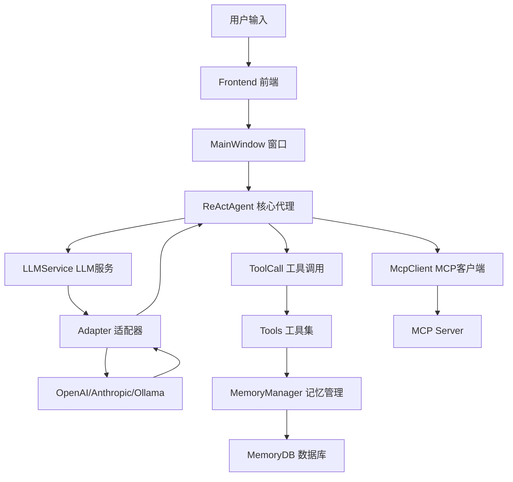

# TransMAgent 项目概述与架构

## 1. 项目简介

**TransMAgent** 是一款跨平台的多智能体转录调控分析系统，支持 **Windows、macOS 与 Linux**。

### 核心特性

- 🧠 **增强记忆机制** - 基于向量数据库的长期记忆存储与检索
- 🤖 **多智能体协作体系** - 支持主智能体与子智能体协同工作
- 🔌 **MCP 工具服务** - Model Context Protocol 工具服务集成
- 🛡️ **虚拟化安全执行环境** - 安全沙箱执行代码
- 📊 **大规模转录调控数据库** - 生物信息学数据支持

---

## 2. 技术栈

| 层级 | 技术 |
|------|------|
| 框架 | Electron (跨平台桌面应用) |
| 语言 | TypeScript + JavaScript |
| 后端核心 | Node.js |
| 前端 | 原生 HTML/CSS/JavaScript |
| 数据库 | SQLite + sqlite-vec (向量搜索) |
| LLM | OpenAI / Anthropic / Ollama |

---

## 3. 项目目录结构

```
transmagent/
├── src/
│   ├── backend/
│   │   ├── src/
│   │   │   ├── main.ts              # Electron 主进程入口
│   │   │   ├── types.ts             # 全局类型定义
│   │   │   ├── adapters/            # LLM 适配器
│   │   │   ├── core/                # 核心业务逻辑
│   │   │   ├── tools/               # 工具函数
│   │   │   ├── main/                # 窗口管理
│   │   │   ├── data/                # 数据存储
│   │   │   ├── utils/               # 工具函数
│   │   │   ├── server/              # 网络服务
│   │   │   └── mouse/               # 鼠标捕获
│   │   └── dist/                    # 编译输出
│   └── frontend/
│       ├── js/main/                  # 前端主逻辑
│       ├── css/                      # 样式文件
│       └── img/                      # 图片资源
├── skills/                           # 技能配置目录
├── docs/                             # 文档目录
└── dist/                             # 打包输出
```

---

## 4. 核心架构流程



---

## 5. 主要模块说明

| 模块 | 路径 | 功能 |
|------|------|------|
| **main.ts** | `src/backend/src/main.ts` | Electron 主进程入口，初始化应用 |
| **ReActAgent** | `src/backend/src/core/ReActAgent.ts` | ReAct 推理代理，核心业务逻辑 |
| **LLMService** | `src/backend/src/core/LLMService.ts` | LLM 服务封装，统一调用接口 |
| **ToolCall** | `src/backend/src/core/ToolCall.ts` | 工具调用管理 |
| **WindowManager** | `src/backend/src/main/windows/WindowManager.ts` | 窗口生命周期管理 |

---

## 6. 入口文件：main.ts

### 功能概述

Electron 主进程入口，负责：
1. 安装 source-map-support 支持
2. 初始化全局日志
3. 创建应用窗口
4. 注册全局快捷键
5. 启动 HTTP 服务器

### 关键代码流程

```typescript
// 1. 引入 source-map-support (必须在最前面)
sourceMapSupport.install();

// 2. 初始化日志
logger.init(app.getPath('userData'));

// 3. 安装应用资源
install.install();

// 4. 创建窗口管理器
const windowManager = new WindowManager();

// 5. 注册快捷键
const shortcut = new Shortcut(windowManager);

// 6. 启动服务器
MainServer.start(windowManager);
```

---

## 7. 下一步

- 查看 `02_TYPES.md` 了解全局类型定义
- 查看 `03_ADAPTERS.md` 了解 LLM 适配器实现
