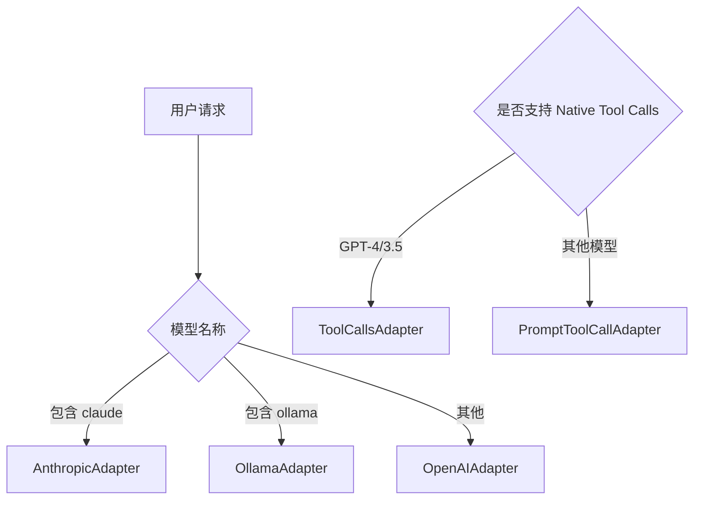

# 适配器模块文档 (Adapters)

## 文件路径
```
src/backend/src/adapters/
├── IAdapter.ts              # 适配器接口定义
├── AdapterFactory.ts        # 适配器工厂
├── OpenAIAdapter.ts         # OpenAI API 适配器
├── AnthropicAdapter.ts      # Anthropic API 适配器
├── OllamaAdapter.ts         # Ollama 本地模型适配器
├── ToolCallsAdapter.ts      # Native Tool Calls 适配器
└── PromptAdapter.ts         # Prompt 工具调用适配器
```

---

## 1. 适配器接口 (IAdapter.ts)

### ILLMAdapter 接口
LLM 通信适配器接口，定义与 LLM API 通信的核心方法。

```typescript
export interface ILLMAdapter {
    // 过滤和格式化发送给 API 的消息
    formatMessages(messages: AssistantMessage[], data: ChatRequestData): any[];
    
    // 组装最终的 Fetch Request Body
    buildPayload(data: ChatRequestData, formattedMessages: any[]): Record<string, any>;

    // 构建请求头
    buildHeaders(): Record<string, string>;

    // 解析流式响应
    parseStreamChunk(chunk: string): StreamChunkResult | null;

    // 解析非流式响应
    parseResponse(data: any): string;
}
```

| 方法 | 参数 | 返回值 | 描述 |
|------|------|--------|------|
| `formatMessages` | `messages`, `data` | `any[]` | 格式化对话消息 |
| `buildPayload` | `data`, `formattedMessages` | `Record` | 构建请求体 |
| `buildHeaders` | 无 | `Record` | 构建请求头 |
| `parseStreamChunk` | `chunk` | `StreamChunkResult \| null` | 解析流式块 |
| `parseResponse` | `data` | `string` | 解析完整响应 |

---

### IToolCallAdapter 接口
工具调用适配器接口，定义工具调用的格式转换。

```typescript
export interface IToolCallAdapter {
    // 提取工具调用信息
    extractToolCalls(assistantMessage: any): ToolCall[] | null;
    
    // 格式化工具定义
    formatTools(toolSchemas: any[]): any;
}
```

---

## 2. 适配器工厂 (AdapterFactory.ts)

### LLMAdapterFactory
根据模型名称创建对应的 LLM 适配器。

```typescript
export class LLMAdapterFactory {
    static getAdapter(modelName: string): ILLMAdapter {
        const model = modelName.toLowerCase();
        
        if (model.includes('claude') || model.includes('anthropic')) {
            return new AnthropicAdapter();
        } else if (model.includes('ollama')) {
            return new OllamaAdapter();
        } else {
            return new OpenAIAdapter(); // 默认使用 OpenAI
        }
    }
}
```

**支持模型**：
| 模型前缀 | 适配器 |
|---------|--------|
| `claude` / `anthropic` | `AnthropicAdapter` |
| `ollama` | `OllamaAdapter` |
| 其他 | `OpenAIAdapter` (默认) |

---

### ToolCallAdapterFactory
根据模型名称创建对应的工具调用适配器。

```typescript
export class ToolCallAdapterFactory {
    static getAdapter(modelName: string): IToolCallAdapter {
        const model = modelName.toLowerCase();
        
        if (model.includes('gpt-4') || model.includes('gpt-3.5')) {
            return new ToolCallsAdapter(); // Native Tool Calls
        } else {
            return new PromptToolCallAdapter(); // Prompt 嵌入方式
        }
    }
}
```

---

## 3. OpenAI 适配器 (OpenAIAdapter.ts)

### 功能概述
适配 OpenAI API (GPT-4, GPT-3.5 等) 的通信格式。

### 核心逻辑

#### formatMessages - 消息格式化
```typescript
formatMessages(messages: Message[], data: ChatRequestData): any[]
```
- 深度拷贝消息，移除内部状态字段
- 处理图片内容的 URL 格式
- 保持与 OpenAI API 格式兼容

#### buildPayload - 构建请求体
```typescript
buildPayload(data: ChatRequestData, formattedMessages: any[]): Record<string, any>
```
关键字段：
| 字段 | 来源 | 描述 |
|------|------|------|
| `model` | `data.model` | 模型名称 |
| `messages` | `formattedMessages` | 格式化后的消息 |
| `temperature` | `data.temperature` | 温度参数 |
| `max_tokens` | `data.max_tokens` | 最大 token |
| `stream` | `true` | 流式输出 |
| `tools` | 工具定义 | 函数调用定义 |

#### parseStreamChunk - 解析流式响应
处理 OpenAI 的 SSE 格式响应，提取增量文本和工具调用。

---

## 4. Anthropic 适配器 (AnthropicAdapter.ts)

### 功能概述
适配 Anthropic API (Claude 系列) 的通信格式。

### 核心逻辑

#### formatMessages - 消息格式化
```typescript
formatMessages(messages: Message[], data: ChatRequestData): any[]
```
- **过滤掉 system 消息**（Anthropic 单独处理）
- 转换消息格式为 Anthropic 的格式

#### buildPayload - 构建请求体
关键字段：
| 字段 | 来源 | 描述 |
|------|------|------|
| `model` | `data.model` | Claude 模型名 |
| `messages` | 过滤后的消息 | 对话消息 |
| `system` | `data.system_prompt` | 系统提示（单独字段） |
| `temperature` | `data.temperature` | 温度参数 |
| `max_tokens` | 固定值 `4096` | 最大 token |
| `stream` | `true` | 流式输出 |

**注意**：Anthropic 使用 `streaming_delta` 而非 `content_block_delta`。

---

## 5. Ollama 适配器 (OllamaAdapter.ts)

### 功能概述
适配 Ollama 本地模型的 API 调用。

### 特点
- 支持本地部署的大语言模型
- API 格式与 OpenAI 兼容

### 核心逻辑

#### buildHeaders - 请求头
```typescript
buildHeaders(): Record<string, string>
```
Ollama 默认端口 `11434`。

#### buildPayload - 请求体
| 字段 | 描述 |
|------|------|
| `model` | 模型名称（去掉 `ollama:` 前缀） |
| `messages` | 对话消息 |
| `stream` | 流式输出 |

---

## 6. ToolCalls 适配器 (ToolCallsAdapter.ts)

### 功能概述
从 `message.tool_calls` 直接提取工具调用信息。

### 适用场景
- OpenAI API (function calling)
- 支持原生工具调用格式的模型

### extractToolCalls 方法
```typescript
extractToolCalls(assistantMessage: any): ToolCall[] | null
```
- 检查 `assistantMessage.tool_calls` 是否存在
- 转换为统一的 `ToolCall` 格式
- 返回 `null` 表示无工具调用

---

## 7. Prompt 适配器 (PromptAdapter.ts)

### 功能概述
通过 Prompt 嵌入方式实现工具调用，适用于不支持原生 Tool Calls 的模型。

### formatTools 方法
```typescript
formatTools(toolSchemas: any[]): any
```
- 将工具定义转换为自然语言描述
- 生成工具使用说明 Prompt

### 工具描述格式
```
tool_name: 工具名称
description: 工具功能描述
parameters:
- name: 参数名
  type: 参数类型
  description: 参数描述
```

---

## 8. 适配器选择流程



---

## 9. 添加新适配器

如需添加新模型的适配器：

1. 在 `adapters/` 目录创建新文件（如 `GeminiAdapter.ts`）
2. 实现 `ILLMAdapter` 接口
3. 在 `AdapterFactory.ts` 的 `getAdapter` 方法中添加分支
4. 如需要，实现对应的 `IToolCallAdapter`

---

## 10. 下一步

- 查看 `04_CORE.md` 了解 ReActAgent 如何使用这些适配器
