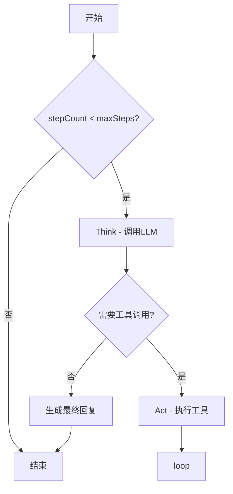
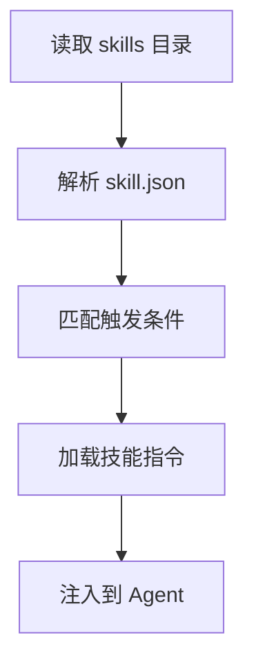

# 核心模块文档 (Core)

## 文件路径
```
src/backend/src/core/
├── ReActAgent.ts           # ReAct 推理代理核心
├── LLMService.ts           # LLM 服务封装
├── LLMAssistant.ts         # LLM 对话辅助
├── ToolCall.ts             # 工具调用管理
├── base_tools.ts          # 基础工具集
├── ChatManager.ts          # 聊天会话管理
├── ChainCall.ts           # 链式调用代理
├── Prompts.ts              # 提示词管理
├── SkillManager.ts         # 技能管理器
├── Plugins.ts              # 插件系统
├── McpClient.ts            # MCP 客户端
└── Install.ts              # 安装初始化
```

---

## 1. ReActAgent.ts - ReAct 推理代理核心

### 功能概述
ReAct (Reasoning + Acting) 代理是项目的核心，负责：
1. 管理 Agent 的状态机
2. 执行 ReAct 推理循环
3. 协调工具调用与 LLM 交互

### Agent 状态枚举
```typescript
export enum State {
    IDLE = 'idle',         // 空闲状态
    THINKING = 'thinking',  // 思考中
    ACTING = 'acting',     // 执行工具中
    WAITING = 'waiting',    // 等待用户输入
    FINISHED = 'finished',  // 完成
    ERROR = 'error'        // 错误
}
```

### Agent 模式枚举
```typescript
export enum Mode {
    AUTO = 'auto',         // 自动模式：思考-行动循环
    ACT = 'act',           // 行动模式：直接执行
    PLAN = 'plan',         // 计划模式：先规划后执行
    FLASH = 'flash'        // 闪速模式：快速响应
}
```

### 核心属性
| 属性 | 类型 | 描述 |
|------|------|------|
| `state` | `State` | 当前状态 |
| `mode` | `Mode` | 运行模式 |
| `stepCount` | `number` | 当前步数计数 |
| `maxSteps` | `number` | 最大步数限制 |
| `chatManager` | `ChatManager` | 聊天管理器 |
| `llmService` | `LLMService` | LLM 服务 |

### 核心方法

#### start() - 启动 Agent
```typescript
async start(): Promise<void>
```
- 初始化状态为 `THINKING`
- 启动主循环

#### think() - 思考阶段
```typescript
async think(): Promise<void>
```
- 调用 LLM 生成响应
- 处理流式输出
- 检测工具调用请求

#### act() - 行动阶段
```typescript
async act(): Promise<void>
```
- 解析工具调用请求
- 执行工具
- 生成工具结果消息

#### loop() - 主循环
```typescript
async loop(): Promise<void>
```


---

## 2. LLMService.ts - LLM 服务封装

### 功能概述
统一封装 LLM API 调用，提供：
1. 统一的聊天接口
2. 流式响应处理
3. 工具调用支持

### 核心方法

#### chat() - 发送聊天请求
```typescript
async chat(data: ChatRequestData): Promise<string>
```
- 格式化消息
- 发送请求到 LLM
- 返回完整响应

#### chatStream() - 流式聊天
```typescript
async chatStream(data: ChatRequestData, onChunk: Function): Promise<void>
```
- 流式发送请求
- 回调处理每个响应块

#### executeToolCalls() - 执行工具调用
```typescript
async executeToolCalls(toolCalls: ToolCall[]): Promise<ToolMessage[]>
```
- 解析工具名称和参数
- 调用工具函数
- 返回执行结果

---

## 3. ToolCall.ts - 工具调用管理

### 功能概述
管理所有可用工具的注册、调用和生命周期。

### 核心属性
| 属性 | 类型 | 描述 |
|------|------|------|
| `tools` | `Record<string, ToolInfo>` | 注册的工具映射 |
| `functions` | `Record<string, Function>` | 工具函数映射 |
| `windowManager` | `WindowManager` | 窗口管理器引用 |

### 核心方法

#### registerTool() - 注册工具
```typescript
registerTool(toolName: string, toolInfo: ToolInfo, func: Function): void
```
- 将工具添加到注册表
- 验证工具定义

#### executeTool() - 执行工具
```typescript
async executeTool(toolName: string, args: any): Promise<any>
```
- 从注册表查找工具
- 执行工具函数
- 处理异常

#### getToolSchemas() - 获取工具定义
```typescript
getToolSchemas(): ToolInfo[]
```
- 返回所有工具的 JSON Schema

---

## 4. base_tools.ts - 基础工具集

### 功能概述
系统内置的基础工具集，通过 `getBaseTools()` 工厂函数导出。

### 可用工具

#### update_env - 更新环境变量
```typescript
update_env({ key: string, value: any }): void
```
- 写入共享全局内存
- 用于 Agent 间数据共享

#### record_subtasks - 记录任务进度
```typescript
record_subtasks({ subtask_ids: number[], status: string, reflection?: string }): void
```
- 标记子任务状态
- 记录执行结果

#### add_subtasks - 添加子任务
```typescript
add_subtasks({ task: string, subtasks: string[], task_type?: string }): void
```
- 创建跟踪任务
- 支持标准/循环任务类型

#### ask_user - 请求用户输入
```typescript
ask_user({ ask: string, options?: string[] }): void
```
- 向用户提问
- 支持选项列表

#### search_long_term_memory - 搜索长期记忆
```typescript
search_long_term_memory({ query: string, top_k?: number }): string[]
```
- 基于向量相似度搜索记忆

---

## 5. ChatManager.ts - 聊天会话管理

### 功能概述
管理对话历史消息的存储和检索。

### 核心属性
| 属性 | 类型 | 描述 |
|------|------|------|
| `messages` | `Message[]` | 消息历史 |
| `MAX_HISTORY` | `number` | 最大历史长度 |

### 核心方法

#### addMessage() - 添加消息
```typescript
addMessage(message: Message): void
```
- 添加到消息列表
- 必要时裁剪历史

#### getMessages() - 获取消息
```typescript
getMessages(): Message[]
```

#### clearHistory() - 清除历史
```typescript
clearHistory(): void
```

---

## 6. Prompts.ts - 提示词管理

### 功能概述
管理不同模式的系统提示词和约束条件。

### 模式约束 (MODE_CONSTRAINTS)
```typescript
export const MODE_CONSTRAINTS: Record<Mode, string>
```

| 模式 | 约束描述 |
|------|---------|
| `AUTO` | 完整的 ReAct 循环：思考→行动→观察 |
| `ACT` | 直接行动：快速执行工具 |
| `PLAN` | 计划优先：先生成计划再执行 |
| `FLASH` | 快速响应：跳过详细推理 |

### 提示词结构
```
系统提示 = 基础指令 + 模式约束 + 可用工具描述 + 记忆上下文
```

---

## 7. McpClient.ts - MCP 客户端

### 功能概述
连接外部 MCP (Model Context Protocol) 服务器，扩展工具能力。

### 核心方法

#### connect() - 连接 MCP 服务器
```typescript
async connect(config: McpConfig): Promise<void>
```
- 建立 Stdio 或 HTTP 传输连接
- 获取可用工具列表

#### listTools() - 列出工具
```typescript
async listTools(): Promise<ToolInfo[]>
```

#### callTool() - 调用 MCP 工具
```typescript
async callTool(toolName: string, args: any): Promise<any>
```

---

## 8. SkillManager.ts - 技能管理器

### 功能概述
动态加载和管理技能配置。

### 技能加载流程


---

## 9. 下一步

- 查看 `05_TOOLS.md` 了解具体工具实现
- 查看 `06_MAIN.md` 了解窗口管理
