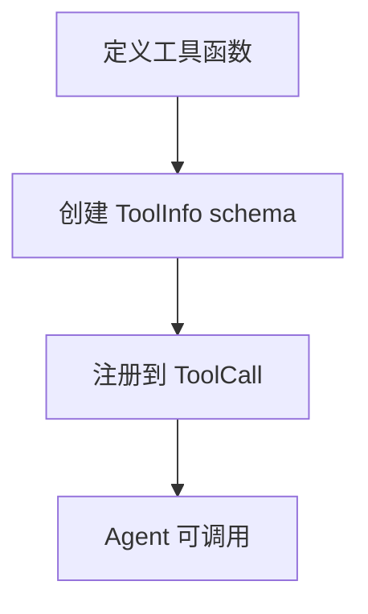

# 工具模块文档 (Tools)

## 文件路径
```
src/backend/src/tools/
├── list_dir.ts              # 文件目录列表
├── write_to_file.ts         # 文件写入
├── search_files.ts          # 文件内容搜索
├── display_file.ts          # 文件读取显示
├── replace_in_file.ts       # 文件内容替换
├── python_execute.ts        # Python 代码执行
├── cli_execute.ts           # CLI 命令执行
├── browser_client.ts        # 浏览器自动化
├── web_crawler_toolkit.ts    # 网页爬取工具
├── image_vision.ts          # 图片视觉分析
├── error_solution_search.ts  # 错误解决方案搜索
├── literature_search.ts      # 文献搜索
├── baidu_translate.ts        # 百度翻译
├── read_tools_prompt.ts      # 读取工具提示
└── update_tool.ts           # 更新工具定义
```

---

## 1. list_dir.ts - 文件目录列表

### 功能概述
递归扫描目录，返回文件列表，支持正则过滤和超时控制。

### 接口定义
```typescript
export interface ListFilesParams {
    path: string;           // 目录路径
    threshold?: number;     // 文件数量阈值
    timeoutMs?: number;     // 超时时间(ms)
}
```

### 核心变量
| 变量 | 类型 | 描述 |
|------|------|------|
| `excludeDirs` | `string[]` | 排除的目录名 |
| `excludeExts` | `string[]` | 排除的文件扩展名 |

### 核心逻辑
1. 递归遍历目录树
2. 跳过 node_modules, .git 等目录
3. 支持正则表达式过滤
4. 超时自动终止

---

## 2. write_to_file.ts - 文件写入

### 功能概述
支持 overwrite 和 append 两种模式的文件写入工具。

### 接口定义
```typescript
export interface WriteParams {
    file_path: string;      // 文件路径
    content: string;        // 写入内容
    mode?: 'overwrite' | 'append';  // 写入模式
}
```

### 写入模式
| 模式 | 描述 |
|------|------|
| `overwrite` | 完全覆盖原文件（默认） |
| `append` | 追加到文件末尾 |

### 核心逻辑
1. 规范化文件路径
2. 确保父目录存在
3. 根据模式写入文件

---

## 3. search_files.ts - 文件内容搜索

### 功能概述
在指定目录下搜索匹配正则表达式的内容。

### 接口定义
```typescript
export interface SearchFilesParams {
    path: string;           // 搜索目录
    regex?: string;         // 正则表达式
    file_pattern?: string;  // 文件名模式（如 *.ts）
    timeout_ms?: number;    // 超时时间
}
```

### 返回格式
```typescript
export interface SearchResult {
    file: string;           // 文件路径
    line: number;          // 行号
    content: string;        // 匹配内容
    context?: string[];     // 上下文行
}
```

---

## 4. display_file.ts - 文件读取显示

### 功能概述
读取文件内容并格式化显示，支持多种文件类型。

### 接口定义
```typescript
export interface DisplayOptions {
    file_path: string;
    start_line?: number;    // 起始行（1-indexed）
    end_line?: number;      // 结束行
    format?: 'auto' | 'text' | 'table' | 'image' | 'pdf';
    max_line_length?: number;
    max_cols?: number;
}
```

### 格式自动检测
| 格式 | 适用文件 |
|------|---------|
| `image` | PNG, JPG, WEBP, SVG, GIF |
| `pdf` | PDF 文件 |
| `table` | CSV, Excel |
| `text` | 代码、文本文件 |

---

## 5. replace_in_file.ts - 文件内容替换

### 功能概述
精确替换文件中的指定内容块，使用 SEARCH/REPLACE 模式。

### 接口定义
```typescript
export interface ReplaceParams {
    file_path: string;
    diff: string;  // 替换差异块
}
```

### diff 格式
```
<<<<<<< SEARCH
[要替换的原始代码片段]
=======
[新的代码片段]
>>>>>>> REPLACE
```

### 核心逻辑
1. 解析 SEARCH/REPLACE 块
2. 查找匹配位置
3. 原子性替换

---

## 6. python_execute.ts - Python 代码执行

### 功能概述
在安全环境中执行 Python 代码，支持多版本 Python。

### 接口定义
```typescript
export interface PythonExecuteParams {
    python_bin: string;     // Python 解释器路径
    code: string;           // Python 代码
    timeout?: number;       // 超时时间(ms)
}
```

### 核心变量
| 变量 | 描述 |
|------|------|
| `pythonBins` | 可用的 Python 路径列表 |

### 安全机制
1. 临时文件执行
2. 执行后自动清理
3. 超时终止

---

## 7. cli_execute.ts - CLI 命令执行

### 功能概述
执行本地或远程（SSH）命令行指令。

### 接口定义
```typescript
export interface CliParams {
    command: string;        // 命令
    cwd?: string;           // 工作目录
    timeout?: number;      // 超时时间
    isSsh?: boolean;       // 是否 SSH 执行
    sshConfig?: ConnectConfig;  // SSH 配置
}
```

### SSH 配置
```typescript
interface ConnectConfig {
    host: string;
    port?: number;
    username: string;
    password?: string;
    privateKey?: string;
}
```

---

## 8. browser_client.ts - 浏览器自动化

### 功能概述
基于 Puppeteer 的浏览器自动化工具，支持页面操作和截图。

### 主要操作
| 操作 | 描述 |
|------|------|
| `open` | 打开浏览器 |
| `navigate` | 导航到 URL |
| `click` | 点击元素 |
| `type` | 输入文本 |
| `screenshot` | 截图 |
| `get_content` | 获取页面内容 |

### 接口定义
```typescript
export interface BrowserParams {
    operation: string;
    url?: string;
    action?: string;
    selector?: string;
    js?: string;
}
```

---

## 9. web_crawler_toolkit.ts - 网页爬取工具

### 功能概述
多引擎网页搜索和内容提取工具。

### 核心功能
| 功能 | 描述 |
|------|------|
| `search` | DuckDuckGo/Baidu 网页搜索 |
| `read_url` | 抓取指定 URL 内容 |
| `select` | 从搜索结果中提取内容 |

### 接口定义
```typescript
export interface SearchResultItem {
    url: string;
    summ?: string;
    title?: string;
}
```

### 配置参数
```typescript
interface CrawlerConfig {
    action: 'search' | 'read_url' | 'select';
    query?: string[];
    url?: string;
    topk?: number;
    max_length?: number;
    timeout?: number;
}
```

---

## 10. image_vision.ts - 图片视觉分析

### 功能概述
读取并分析视觉文件（图片、PDF），支持本地和远程路径。

### 接口定义
```typescript
export interface ImageVisionParams {
    file_path: string;      // 图片路径
    prompt?: string;        // 分析提示词
}
```

### 支持格式
- 图片：PNG, JPG, WEBP, SVG, GIF
- 文档：PDF（通过 headless 浏览器渲染）

### 核心逻辑
1. 检测文件类型
2. 转换为 Base64 或数据 URL
3. 调用 LLM 视觉能力分析

---

## 11. literature_search.ts - 文献搜索

### 功能概述
集成多个学术数据库的文献检索工具。

### 支持数据源
| 源 | 说明 |
|------|------|
| `pubmed` | 生物医学文献 |
| `arxiv` | 预印本论文 |
| `semantic` | 语义学术搜索 |
| `crossref` | DOI 元数据 |

### 接口定义
```typescript
export interface LiteratureSearchParams {
    query: string;
    maxResults?: number;
    dateFrom?: string;      // YYYY-MM-DD
    dateTo?: string;
    source?: 'all' | 'pubmed' | 'arxiv' | 'semantic' | 'crossref';
    sortBy?: 'relevance' | 'date';
}
```

---

## 12. error_solution_search.ts - 错误解决方案搜索

### 功能概述
自动搜索错误信息的解决方案。

### 接口定义
```typescript
export interface ErrorSolutionParams {
    error_message: string;
    max_results?: number;
}
```

### 搜索策略
1. 提取错误关键信息
2. 调用 web_crawler_toolkit 搜索
3. 返回 StackOverflow/GitHub 等解决方案

---

## 13. baidu_translate.ts - 百度翻译

### 功能概述
调用百度翻译 API 进行文本翻译。

### 接口定义
```typescript
export interface TranslateParams {
    query: string;
    from?: string;   // 源语言
    to?: string;     // 目标语言
}
```

---

## 14. 工具注册流程



### 新增工具示例
```typescript
// 1. 定义函数
async function myTool(params) { ... }

// 2. 定义 schema
const schema = {
    name: 'myTool',
    description: '工具描述',
    parameters: { type: 'object', properties: {...} }
};

// 3. 注册
toolCall.registerTool('myTool', schema, myTool);
```

---

## 15. 下一步

- 查看 `06_MAIN.md` 了解窗口管理
- 查看 `07_DATA.md` 了解数据存储
