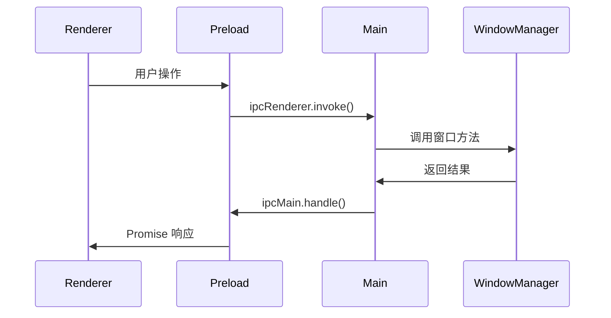

# 主进程与窗口管理文档 (Main)

## 文件路径
```
src/backend/src/main/
├── windows/
│   ├── WindowManager.ts     # 窗口生命周期管理
│   ├── BaseWindow.ts       # 窗口基类
│   ├── MainWindow.ts       # 主窗口
│   ├── SubAgentWindow.ts   # 子智能体窗口
│   ├── AlertWindow.ts      # 警告窗口
│   ├── ConfigWindow.ts     # 配置窗口
│   ├── ModelWindow.ts      # 模型选择窗口
│   ├── CodeWindow.ts       # 代码显示窗口
│   ├── ToolWindow.ts       # 工具窗口
│   ├── ConfirmationWindow.ts  # 确认对话框
│   ├── IconWindow.ts       # 图标窗口
│   └── OverlayWindow.ts    # 悬浮窗口
├── preloads/
│   ├── main_window_preload.ts   # 主窗口预加载脚本
│   └── subagent_window_preload.ts  # 子窗口预加载脚本
└── Shortcut.ts             # 全局快捷键管理
```

---

## 1. WindowManager.ts - 窗口管理器

### 功能概述
统一管理应用中所有窗口的生命周期，包括创建、销毁、切换等操作。

### 核心属性
| 属性 | 类型 | 描述 |
|------|------|------|
| `windows` | `Map<string, BaseWindow>` | 所有窗口的映射 |
| `mainWindow` | `MainWindow` | 主窗口引用 |

### 核心方法

#### createWindow() - 创建窗口
```typescript
createWindow(type: string, options?: WindowOptions): BrowserWindow
```
- 根据类型创建对应窗口
- 注册到窗口映射表
- 返回 BrowserWindow 实例

#### closeWindow() - 关闭窗口
```typescript
closeWindow(id: string): void
```
- 从映射表移除
- 销毁窗口实例

#### getWindow() - 获取窗口
```typescript
getWindow(id: string): BrowserWindow | null
```

---

## 2. BaseWindow.ts - 窗口基类

### 功能概述
所有窗口的抽象基类，定义通用窗口行为。

### 类结构
```typescript
export abstract class BaseWindow {
    windowManager: WindowManager;
    window: BrowserWindow | null;
    
    abstract createWindow(): void;
    show(): void;
    hide(): void;
    close(): void;
}
```

### 通用方法
| 方法 | 描述 |
|------|------|
| `createWindow()` | 抽象方法，子类实现具体创建逻辑 |
| `show()` | 显示窗口 |
| `hide()` | 隐藏窗口 |
| `close()` | 关闭窗口 |

---

## 3. MainWindow.ts - 主窗口

### 功能概述
应用的主交互窗口，包含聊天界面和工具栏。

### 核心功能
| 功能 | 描述 |
|------|------|
| 聊天界面 | 消息输入和显示 |
| 模式切换 | AUTO/ACT/PLAN/FLASH 模式 |
| 历史管理 | 聊天记录保存和加载 |
| 工具栏 | 快捷操作按钮 |

### IPC 通信
| 通道 | 方向 | 描述 |
|------|------|------|
| `start-chat` | renderer → main | 开始聊天 |
| `stop-chat` | renderer → main | 停止聊天 |
| `show-result` | main → renderer | 显示结果 |
| `update-progress` | main → renderer | 更新进度 |

---

## 4. SubAgentWindow.ts - 子智能体窗口

### 功能概述
独立的子智能体工作窗口，用于多智能体协作。

### 核心属性
| 属性 | 类型 | 描述 |
|------|------|------|
| `agent` | `ReActAgent` | 子智能体实例 |
| `plugins` | `Plugins` | 插件集合 |

### 通信机制
- 通过 IPC 与主窗口通信
- 支持独立的任务执行
- 结果汇报给主窗口

---

## 5. 窗口类型说明

### AlertWindow - 警告窗口
用于显示重要警告信息：
```typescript
showAlert(title: string, message: string, type: 'info' | 'warning' | 'error'): void
```

### ConfigWindow - 配置窗口
编辑 JSON 配置文件：
```typescript
openConfig(): void
saveConfig(): void
```

### ModelWindow - 模型选择窗口
选择 LLM 模型：
```typescript
selectModel(): Promise<string>
```

### CodeWindow - 代码窗口
显示代码内容（语法高亮）：
```typescript
showCode(code: string, language: string): void
```

### ToolWindow - 工具窗口
展示可用工具列表和调用状态。

### ConfirmationWindow - 确认对话框
用户确认操作：
```typescript
confirm(title: string, message: string): Promise<boolean>
```

### IconWindow - 图标窗口
系统托盘图标管理。

### OverlayWindow - 悬浮窗口
可自定义位置的悬浮界面。

---

## 6. 预加载脚本 (Preloads)

### main_window_preload.ts
主窗口的预加载脚本，暴露安全的 API 给渲染进程：

```typescript
// 暴露给渲染进程的 API
contextBridge.exposeInMainWorld('electronAPI', {
    startChat: (data) => ipcRenderer.invoke('start-chat', data),
    stopChat: () => ipcRenderer.invoke('stop-chat'),
    showLog: (data) => ipcRenderer.send('show-log', data),
    // ...
});
```

### subagent_window_preload.ts
子窗口预加载脚本，类似但针对子智能体。

---

## 7. Shortcut.ts - 全局快捷键

### 功能概述
注册和管理全局键盘快捷键。

### 核心方法

#### register() - 注册快捷键
```typescript
register(accelerator: string, callback: Function): void
```

#### unregister() - 注销快捷键
```typescript
unregister(accelerator: string): void
```

### 内置快捷键
| 快捷键 | 功能 |
|--------|------|
| `CommandOrControl+Shift+T` | 切换主窗口显示 |
| `CommandOrControl+Shift+S` | 截取屏幕坐标 |
| `Escape` | 关闭窗口 |

---

## 8. 窗口通信流程



---

## 9. 创建新窗口类型

### 步骤 1: 继承 BaseWindow
```typescript
export class NewWindow extends BaseWindow {
    createWindow(): void {
        this.window = new BrowserWindow({
            width: 800,
            height: 600,
            // ...
        });
    }
}
```

### 步骤 2: 注册到 WindowManager
```typescript
// WindowManager 中添加
this.windows.set('new', new NewWindow(this));
```

### 步骤 3: 导出创建方法
```typescript
createNewWindow(): NewWindow {
    return this.windows.get('new') as NewWindow;
}
```

---

## 10. 下一步

- 查看 `07_DATA.md` 了解数据存储
- 查看 `08_UTILS.md` 了解工具函数
