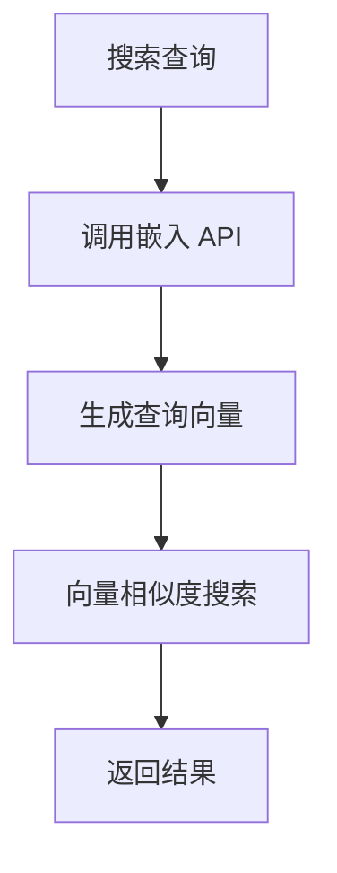
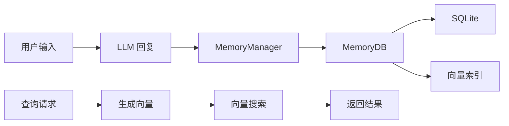

# 数据管理模块文档 (Data)

## 文件路径
```
src/backend/src/data/
├── MemoryDB.ts       # SQLite 数据库封装
└── MemoryManager.ts  # 记忆管理器
```

---

## 1. MemoryDB.ts - SQLite 数据库封装

### 功能概述
封装 SQLite + sqlite-vec 数据库，提供向量搜索能力，用于存储 Agent 的长期记忆。

### 依赖
| 依赖 | 用途 |
|------|------|
| `sqlite3` | SQLite 数据库驱动 |
| `sqlite-vec` | 向量搜索扩展 |

### 核心属性
| 属性 | 类型 | 描述 |
|------|------|------|
| `db` | `sqlite3.Database` | 数据库连接 |
| `vectorTable` | `string` | 向量表名 |

### 核心方法

#### constructor() - 构造函数
```typescript
constructor(dbPath?: string)
```
- 创建或打开数据库
- 初始化表结构

#### initialize() - 初始化表
```typescript
async initialize(): Promise<void>
```
创建以下表结构：
```sql
-- 消息表
CREATE TABLE messages (
    id INTEGER PRIMARY KEY AUTOINCREMENT,
    chat_id TEXT,
    role TEXT,
    content TEXT,
    created_at TIMESTAMP DEFAULT CURRENT_TIMESTAMP
);

-- 向量记忆表
CREATE TABLE IF NOT EXISTS vec_memory (
    id INTEGER PRIMARY KEY AUTOINCREMENT,
    content TEXT NOT NULL,
    metadata TEXT,
    created_at TIMESTAMP DEFAULT CURRENT_TIMESTAMP
);

-- 向量索引（使用 sqlite-vec）
CREATE VIRTUAL TABLE IF NOT EXISTS vec_memory_idx USING vec0();
```

#### insertMessage() - 插入消息
```typescript
async insertMessage(chatId: string, role: string, content: string): Promise<number>
```
- 保存聊天消息到数据库
- 返回插入的 ID

#### searchVectors() - 向量搜索
```typescript
async searchVectors(query: number[], limit: number = 5): Promise<SearchResult[]>
```
| 参数 | 类型 | 描述 |
|------|------|------|
| `query` | `number[]` | 查询向量（嵌入向量） |
| `limit` | `number` | 返回结果数量 |

#### insertVector() - 插入向量
```typescript
async insertVector(content: string, vector: number[], metadata?: object): Promise<void>
```
- 存储内容及其向量表示
- 支持元数据附加

---

## 2. MemoryManager.ts - 记忆管理器

### 功能概述
管理 Agent 的记忆存储和检索，包括：
1. 对话历史管理
2. 长期记忆存储
3. 基于嵌入向量的语义搜索

### 核心属性
| 属性 | 类型 | 描述 |
|------|------|------|
| `db` | `MemoryDB` | 数据库实例 |
| `embeddingConfig` | `EmbeddingConfig` | 嵌入配置 |
| `baseURL` | `string` | API 服务器地址 |

### 嵌入配置
```typescript
interface EmbeddingConfig {
    baseURL: string;      // 向量服务地址
    apiKey?: string;     // API 密钥
    model?: string;      // 嵌入模型
    batchSize?: number;  // 批处理大小
}
```

### 核心方法

#### constructor() - 构造函数
```typescript
constructor(config?: MemoryConfig)
```
- 初始化数据库
- 配置嵌入服务

#### saveMessage() - 保存消息
```typescript
async saveMessage(chatId: string, message: Message): Promise<void>
```
- 序列化消息
- 存入数据库

#### searchMemory() - 搜索记忆
```typescript
async searchMemory(query: string, topK: number = 5): Promise<LongTermMemory[]>
```


#### getEmbedding() - 获取嵌入向量
```typescript
private async getEmbedding(text: string): Promise<number[]>
```
- 调用外部 API 生成向量
- 处理 API 错误

#### addMemory() - 添加记忆
```typescript
async addMemory(content: string, metadata?: object): Promise<void>
```
- 生成嵌入向量
- 存入数据库

---

## 3. 数据流程



---

## 4. 记忆类型

### 短期记忆 (ChatManager)
- 存储当前会话消息
- 限制最大历史长度

### 长期记忆 (MemoryDB)
- 持久化存储
- 支持向量搜索
- 跨会话检索

---

## 5. 配置示例

```typescript
const memoryManager = new MemoryManager({
    dbPath: './data/memory.db',
    embeddingConfig: {
        baseURL: 'http://localhost:8000/v1',
        model: 'text-embedding-ada-002',
        batchSize: 100
    }
});
```

---

## 6. 下一步

- 查看 `08_UTILS.md` 了解工具函数
- 查看 `09_FRONTEND.md` 了解前端模块
