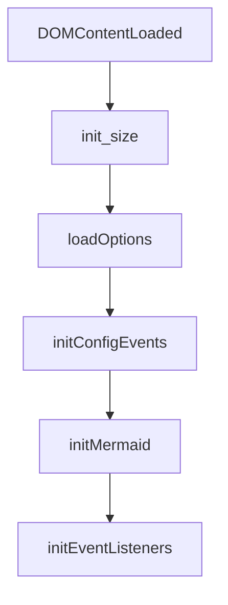
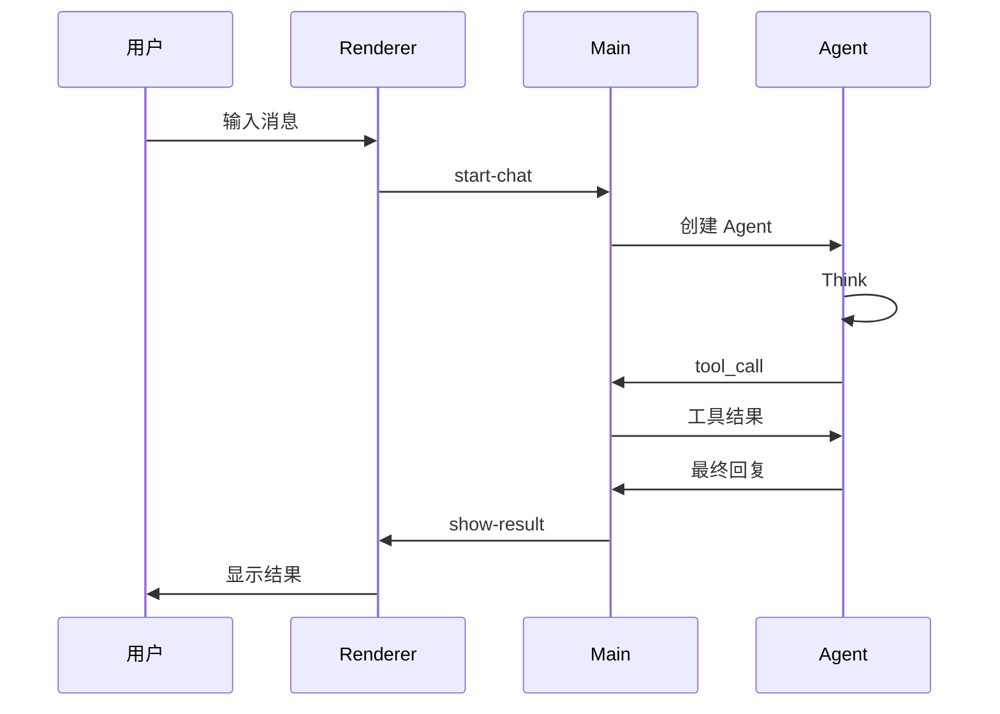

# 前端模块文档 (Frontend)

## 文件路径
```
src/frontend/
├── js/
│   ├── main/
│   │   ├── renderer.ts      # 渲染器主入口
│   │   ├── chat.ts          # 聊天逻辑
│   │   ├── ui.ts            # UI 交互
│   │   ├── config.ts        # 配置管理
│   │   ├── history.ts        # 历史记录
│   │   ├── markdown.ts      # Markdown 渲染
│   │   ├── globals.ts        # 全局变量
│   │   ├── utils.ts          # 工具函数
│   │   └── subagent.ts       # 子智能体
│   └── (lib files)          # 第三方库打包
├── css/                     # 样式文件
└── img/                     # 图片资源
```

---

## 1. globals.ts - 前端全局变量

### 功能概述
定义前端使用的全局常量和 DOM 元素引用。

### DOM 元素引用
```typescript
export const DOM = {
    // 输入区域
    system_prompt: HTMLTextAreaElement,
    file_upload: HTMLElement,
    user_input: HTMLTextAreaElement,
    
    // 模式按钮
    auto: HTMLElement,     // 自动模式
    act: HTMLElement,      // 行动模式
    plan: HTMLElement,     // 计划模式
    flash: HTMLElement,    // 闪速模式
    
    // 控制按钮
    pause: HTMLElement,
    progress_container: HTMLElement,
    
    // 聊天容器
    chat_container: HTMLElement,
    messages_container: HTMLElement,
    
    // 侧边栏
    history_list: HTMLElement,
    sidebar: HTMLElement,
    
    // 其他
    model_selector: HTMLElement,
    config_modal: HTMLElement,
};
```

### 状态常量
```typescript
export const State = {
    IDLE: 'idle',
    RUNNING: 'running',
    PAUSED: 'paused',
    ERROR: 'error'
};
```

### 全局数据对象
```typescript
export const userData = {
    messages: [],      // 用户消息
    currentMode: 'auto',
    chatId: null,
    chatHistory: []    // 所有聊天记录
};

export const infoData = {
    tokens: 0,
    stepCount: 0,
    runningTime: 0
};
```

---

## 2. renderer.ts - 渲染器主入口

### 功能概述
应用前端的入口文件，负责初始化和事件绑定。

### 初始化流程


### 核心初始化函数

#### init_size() - 初始化尺寸
```typescript
function init_size(): void
```
- 调整 textarea 高度
- 初始化布局尺寸

#### loadOptions() - 加载选项
```typescript
function loadOptions(): Promise<void>
```
- 从主进程加载配置
- 填充下拉菜单

#### initMermaid() - 初始化 Mermaid
```typescript
function initMermaid(): void
```
- 初始化 Markdown 图表渲染
- 配置 Mermaid 主题

### 事件绑定
```typescript
function initEventListeners(): void
```
| 事件 | 元素 | 处理函数 |
|------|------|---------|
| `click` | 发送按钮 | `startAgentLoop()` |
| `keydown` | 输入框 | `handleKeyDown()` |
| `click` | 模式切换 | `toggleMode()` |
| `click` | 暂停按钮 | `pauseAgent()` |

---

## 3. chat.ts - 聊天逻辑

### 功能概述
处理聊天消息的发送、接收和显示。

### 核心函数

#### startAgentLoop() - 启动对话循环
```typescript
async function startAgentLoop(): Promise<void>
```


#### addChatItem() - 添加消息项
```typescript
function addChatItem(role: string, content: string, options?: ItemOptions): HTMLElement
```
| 参数 | 类型 | 描述 |
|------|------|------|
| `role` | `string` | `user` 或 `assistant` |
| `content` | `string` | 消息内容 |
| `options` | `ItemOptions` | 显示选项 |

#### createElement() - 创建 DOM 元素
```typescript
function createElement(template: string, data?: object): HTMLElement
```
- 解析 HTML 模板
- 替换变量
- 创建 DOM 元素

---

## 4. ui.ts - UI 交互

### 功能概述
处理用户界面的交互操作。

### 核心函数

#### toggleMode() - 切换模式
```typescript
function toggleMode(mode: string): void
```
- 更新 UI 状态
- 保存到配置

#### toggleSidebar() - 切换侧边栏
```typescript
function toggleSidebar(): void
```

#### updateProgress() - 更新进度
```typescript
function updateProgress(step: number, total: number): void
```

#### showLog() - 显示日志
```typescript
function showLog(type: string, content: string): void
```
| type | 描述 |
|------|------|
| `info` | 信息日志 |
| `warning` | 警告 |
| `error` | 错误 |
| `success` | 成功 |

---

## 5. config.ts - 配置管理

### 功能概述
处理应用配置的读取和保存。

### 核心函数

#### initConfigEvents() - 初始化配置事件
```typescript
function initConfigEvents(): void
```

#### showConfig() - 显示配置窗口
```typescript
function showConfig(): void
```

#### saveConfig() - 保存配置
```typescript
async function saveConfig(): Promise<void>
```

### 配置数据结构
```typescript
interface AppConfig {
    // LLM 配置
    model: string;           // 模型名称
    apiKey?: string;         // API 密钥
    baseURL?: string;        // API 地址
    temperature?: number;     // 温度参数
    maxTokens?: number;      // 最大 token
    
    // Agent 配置
    maxSteps?: number;       // 最大步数
    mode?: 'auto' | 'act' | 'plan' | 'flash';
    
    // 系统配置
    systemPrompt?: string;   // 系统提示词
    mcpServers?: string[];   // MCP 服务器列表
}
```

---

## 6. history.ts - 历史记录

### 功能概述
管理聊天历史记录的保存和加载。

### 核心函数

#### loadHistory() - 加载历史
```typescript
async function loadHistory(): Promise<void>
```

#### saveHistory() - 保存历史
```typescript
async function saveHistory(): Promise<void>
```

#### selectChat() - 选择聊天
```typescript
function selectChat(chatId: string): void
```

#### deleteChat() - 删除聊天
```typescript
async function deleteChat(chatId: string): Promise<void>
```

#### renameChat() - 重命名聊天
```typescript
async function renameChat(chatId: string, newName: string): Promise<void>
```

### 历史数据结构
```typescript
interface ChatHistory {
    id: string;
    title: string;
    messages: Message[];
    createdAt: Date;
    updatedAt: Date;
}
```

---

## 7. markdown.ts - Markdown 渲染

### 功能概述
渲染 Markdown 内容，支持代码高亮和图表。

### 核心函数

#### marked() - Markdown 解析
```typescript
function marked(input: string): string
```

### 支持特性
| 特性 | 库 |
|------|------|
| Markdown 解析 | `marked` |
| 代码高亮 | `highlight.js` |
| 图表渲染 | `mermaid` |
| 数学公式 | `katex` |
| PDF 预览 | `pdf.js` |

### 代码块处理
```typescript
// 检测语言
const language = detectLanguage(codeBlock);

// 应用高亮
const highlighted = hljs.highlight(code, { language });

// 渲染
return `<pre><code class="hljs language-${language}">${highlighted}</code></pre>`;
```

---

## 8. subagent.ts - 子智能体

### 功能概述
管理子智能体窗口的通信。

### 核心函数

#### createSubAgent() - 创建子智能体
```typescript
async function createSubAgent(task: string): Promise<string>
```

#### sendToSubAgent() - 发送消息
```typescript
async function sendToSubAgent(agentId: string, message: string): Promise<void>
```

#### receiveFromSubAgent() - 接收消息
```typescript
function receiveFromSubAgent(agentId: string, callback: Function): void
```

---

## 9. utils.ts - 工具函数

### 功能概述
前端通用工具函数。

### 核心函数

#### getIcon() - 获取图标
```typescript
function getIcon(type: string): string
```

#### formatString() - 字符串格式化
```typescript
function formatString(template: string, data: object): string
```

#### escapeHtml() - HTML 转义
```typescript
function escapeHtml(text: string): string
```

#### copyToClipboard() - 复制到剪贴板
```typescript
async function copyToClipboard(text: string): Promise<void>
```

---

## 10. IPC 通信接口

### 暴露给渲染进程的 API
```typescript
// window.electronAPI
interface ElectronAPI {
    // 聊天
    startChat: (data: ChatData) => Promise<void>;
    stopChat: () => Promise<void>;
    pauseChat: () => Promise<void>;
    
    // 配置
    loadConfig: () => Promise<AppConfig>;
    saveConfig: (config: AppConfig) => Promise<void>;
    
    // 历史
    loadHistory: () => Promise<ChatHistory[]>;
    saveHistory: (history: ChatHistory[]) => Promise<void>;
    
    // 日志
    showLog: (data: LogData) => void;
    
    // 窗口
    openWindow: (type: string) => void;
    closeWindow: () => void;
}
```

---

## 11. 下一步

- 查看 `10_SKILLS.md` 了解技能系统
- 返回 `DEVELOPER_GUIDE.md` 查看完整目录
