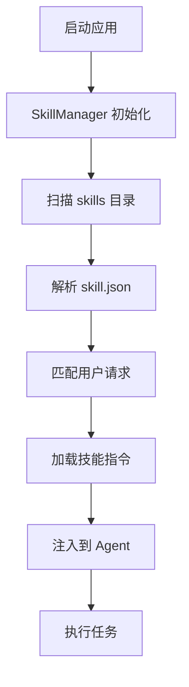
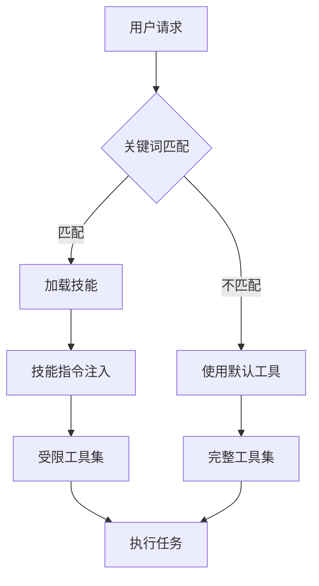

# 技能系统文档 (Skills)

## 文件路径
```
src/backend/skills/
└── *.md                    # 各技能配置文件
```

---

## 1. 技能系统概述

### 功能概述
技能系统允许用户定义和加载自定义能力模块，通过配置文件扩展 Agent 的功能。每个技能包含：
1. **描述** - 技能的用途说明
2. **允许的工具** - 技能可使用的工具列表
3. **触发条件** - 何时激活该技能
4. **指令** - 技能的详细行为定义

### 技能加载流程


---

## 2. 技能配置文件格式

### 基本结构
```yaml
name: skill_name           # 技能名称
description: 技能描述       # 简短描述

trigger:
  keywords:                # 触发关键词
    - keyword1
    - keyword2
  
allowed_tools:            # 允许使用的工具
  - tool_name1
  - tool_name2

instructions: |            # 技能指令
  你是一个专业的...
  当用户请求...
```

---

## 3. SkillManager.ts - 技能管理器

### 文件位置
```
src/backend/src/core/SkillManager.ts
```

### 核心属性
| 属性 | 类型 | 描述 |
|------|------|------|
| `skillsPath` | `string` | 技能目录路径 |
| `skills` | `Skill[]` | 已加载的技能列表 |

### Skill 类型定义
```typescript
export interface Skill {
    name: string;
    description: string;
    allowed_tools?: string[];
    trigger_condition?: string;
    instructions?: string;
}
```

### 核心方法

#### constructor() - 构造函数
```typescript
constructor(skillsPath?: string | null)
```
- 默认路径：`skills/`
- 初始化技能列表

#### loadSkills() - 加载技能
```typescript
loadSkills(): Skill[]
```
- 扫描技能目录
- 解析配置文件
- 返回技能列表

#### matchSkill() - 匹配技能
```typescript
matchSkill(query: string): Skill | null
```
- 根据关键词匹配技能
- 返回匹配的技能或 null

#### getSkillInstructions() - 获取指令
```typescript
getSkillInstructions(skillName: string): string | null
```

---

## 4. 技能触发机制

### 关键词匹配
```typescript
function matchByKeywords(query: string, skill: Skill): boolean {
    const keywords = skill.trigger?.keywords || [];
    return keywords.some(kw => query.includes(kw));
}
```

### 触发条件表达式
```typescript
// 支持的触发条件
{
  "trigger": {
    "condition": "file_ext == '.py' AND lines > 100"
  }
}
```

---

## 5. 技能示例

### 示例 1: 数据清洗技能
```yaml
name: data-cleaner
description: 数据清洗和预处理技能

trigger:
  keywords:
    - 清洗数据
    - 数据预处理
    - 清理缺失值

allowed_tools:
  - python_execute
  - display_file
  - write_to_file

instructions: |
  你是一个专业的数据清洗助手。
  
  数据清洗标准流程：
  1. 检查文件编码
  2. 处理缺失值（数值用均值/中位数，分类用众数）
  3. 标准化列名（小写+下划线）
  4. 验证数据完整性
  
  注意事项：
  - 永远不要生成模拟数据
  - 如果数据损坏，立即报告
```

### 示例 2: 文档生成技能
```yaml
name: document-generator
description: 自动生成项目文档

trigger:
  keywords:
    - 生成文档
    - 写文档
    - 创建 README

allowed_tools:
  - list_dir
  - display_file
  - search_files
  - write_to_file

instructions: |
  你是一个专业的技术文档编写者。
  
  文档生成规范：
  1. 分析项目结构
  2. 提取核心模块说明
  3. 生成 API 文档
  4. 包含使用示例
```

---

## 6. 内置技能 (data-cleaner)

### 功能说明
```typescript
// 在 data-cleaner 技能中定义的标准流程
const dataCleanerWorkflow = {
    step1: '检查文件编码',
    step2: '识别缺失值',
    step3: '处理策略选择',
    step4: '数据转换',
    step5: '验证结果'
};
```

### 工具约束
| 工具 | 用途 |
|------|------|
| `display_file` | 读取原始数据 |
| `python_execute` | 数据处理 |
| `write_to_file` | 保存清洗后数据 |

---

## 7. 创建新技能

### 步骤 1: 创建技能文件
在 `skills/` 目录下创建新的 Markdown 文件：
```bash
touch skills/my-new-skill.md
```

### 步骤 2: 编写技能配置
```yaml
name: my-new-skill
description: 我的新技能描述

trigger:
  keywords:
    - 触发词1
    - 触发词2

allowed_tools:
  - tool1
  - tool2

instructions: |
  技能详细指令...
```

### 步骤 3: 重启应用
技能会在应用启动时自动加载。

---

## 8. 技能与工具的关系



### 关键区别
| 方面 | 普通模式 | 技能模式 |
|------|---------|---------|
| 工具范围 | 所有工具 | 仅允许的工具 |
| 指令 | 默认提示词 | 自定义指令 |
| 触发 | 无 | 关键词匹配 |

---

## 9. 技能优先级

当多个技能匹配时，按以下顺序决定优先级：
1. 关键词数量（多的优先）
2. 定义顺序（先定义优先）
3. 明确性（更具体的描述优先）

---

## 10. 最佳实践

### 技能设计原则
1. **单一职责** - 每个技能只做一件事
2. **明确触发** - 使用具体的关键词
3. **最小工具** - 只允许必要的工具
4. **清晰指令** - 提供详细的操作步骤

### 调试技巧
```typescript
// 查看已加载的技能
console.log(skillManager.skills);

// 测试技能匹配
const matched = skillManager.matchSkill('用户输入');
console.log(matched);
```

---

## 11. 下一步

- 返回 `DEVELOPER_GUIDE.md` 查看完整文档目录
- 开始进行项目开发或交接
