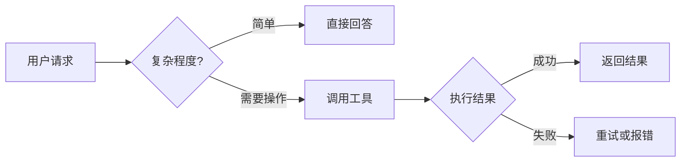

# BaseAgent 模式详解

## 1. 什么是 BaseAgent

**BaseAgent** 是 TransMAgent 最基础的运行模式，提供简洁高效的单一智能体服务。

### 核心定位
```
BaseAgent = 通用型 AI 助手 + 基础工具集
```

### 配置位置
```
src/backend/configs/config_baseagent.json
```

---

## 2. 主要特性

### 2.1 启用功能

| 功能 | 状态 | 说明 |
|------|------|------|
| Python 执行 | ✅ 启用 | 可运行 Python 代码 |
| CLI 命令 | ❌ 禁用 | 出于安全考虑默认关闭 |
| MCP 服务器 | 可配置 | 支持扩展工具 |
| 记忆系统 | 可配置 | 向量数据库检索 |

### 2.2 工具集

BaseAgent 提供以下核心工具：

| 工具 | 功能 |
|------|------|
| `list_dir` | 列出目录文件 |
| `display_file` | 读取文件内容 |
| `write_to_file` | 写入文件 |
| `replace_in_file` | 替换文件内容 |
| `search_files` | 搜索文件内容 |
| `python_execute` | 执行 Python 代码 |
| `ask_user` | 请求用户输入 |

---

## 3. 适用场景

### ✅ 适合的场景
- 快速问答和信息查询
- 简单的代码编写和修改
- 文件整理和文档生成
- 一次性完成的小任务

### ❌ 不适合的场景
- 需要多步骤协调的复杂工作流
- 需要专业领域知识（如生物信息学）
- 需要多个 Agent 并行执行

---

## 4. 使用示例

### 示例 1：快速问答
```
用户: 解释一下什么是闭包

BaseAgent: 
闭包（Closure）是 JavaScript 中的一个重要概念...

✅ 直接回答，无需调用工具
```

### 示例 2：代码编写
```
用户: 用 Python 写一个快速排序

BaseAgent:
```python
def quicksort(arr):
    if len(arr) <= 1:
        return arr
    pivot = arr[len(arr) // 2]
    left = [x for x in arr if x < pivot]
    middle = [x for x in arr if x == pivot]
    right = [x for x in arr if x > pivot]
    return quicksort(left) + middle + quicksort(right)
```

✅ 生成代码，可选择性运行
```

### 示例 3：文件操作
```
用户: 帮我查看当前目录有哪些文件

BaseAgent: [调用 list_dir]
- src/
- docs/
- README.md
- package.json

✅ 执行文件查看操作
```

---

## 5. 工作流程



---

## 6. 与其他模式的区别

| 特性 | BaseAgent | TransAgent | MultiAgent |
|------|-----------|------------|------------|
| Agent 数量 | 1 | 1 | 多个 |
| 专业领域 | 无 | 转录调控 | 工作流编排 |
| 工具扩展 | 基础 | 生物信息学工具 | 子 Agent 调度 |
| 复杂度 | 低 | 中 | 高 |

---

## 7. 快速开始

### 步骤 1：选择模式
在设置中选择 **Agent Mode: BaseAgent**

### 步骤 2：配置 API
```
API Provider: OpenAI / Anthropic / Ollama
API Key: 你的密钥
Model: gpt-4 或 claude-3
```

### 步骤 3：开始使用
```
输入: "帮我写一个计算器程序"
```

---

## 8. 下一步

- 想进行生物信息学分析？查看 `04_TRANSAGENT.md`
- 想进行复杂工作流？查看 `05_MULTAGENT.md`
- 了解运行模式区别？查看 `06_RUNNING_MODES.md`
