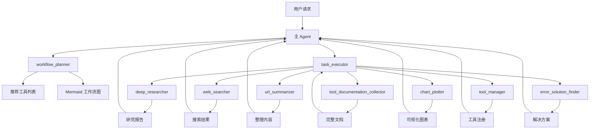
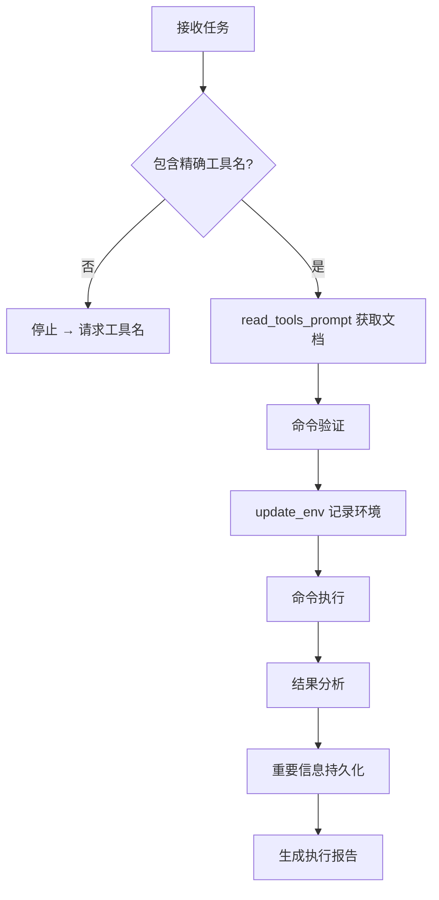
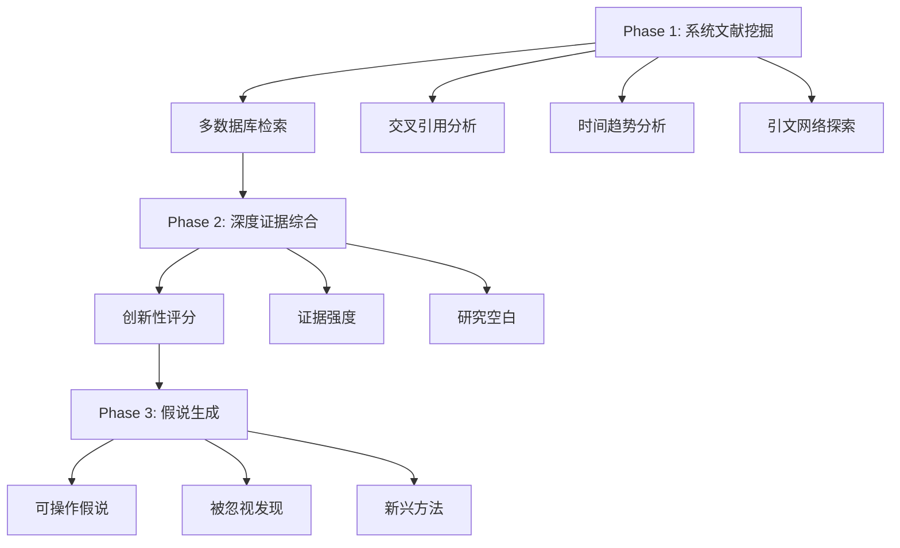
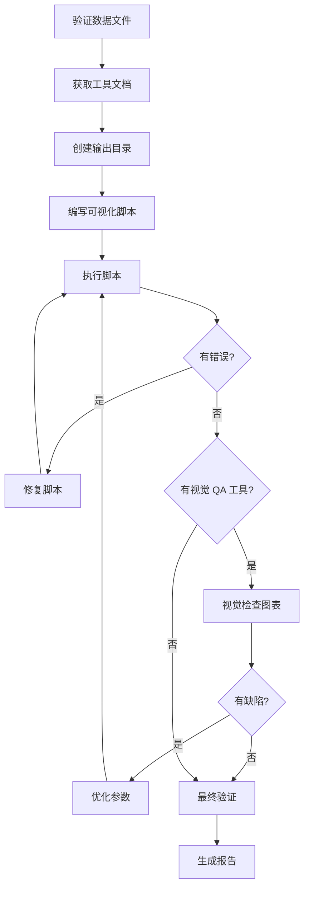

# MultiAgent 模式详解

## 1. 什么是 MultiAgent

**MultiAgent** 是 TransMAgent 的多智能体协作模式，通过主 Agent 协调多个专业子 Agent 并行工作，解决复杂任务。

### 核心定位
```
MultiAgent = 主 Agent（协调者）+ 9 个专业子 Agent（执行者）+ 共享状态管理
```

### 配置位置
```
src/backend/configs/config_multagent.json
```

---

## 2. 子 Agent 体系架构

### 2.1 子 Agent 总览

| 子 Agent | 角色定位 | 核心职责 |
|----------|---------|---------|
| **workflow_planner** | 工作流规划专家 | 分析任务、推荐工具、设计工作流 |
| **task_executor** | 任务执行专家 | 安全高效地调用系统工具 |
| **deep_researcher** | 深度研究专家 | 调研前沿生物学研究 |
| **tool_manager** | 工具管理专家 | 工具构建、安装、维护 |
| **url_summarizer** | URL内容整理专家 | 提取和整理网页信息 |
| **web_searcher** | 网络搜索专家 | 多轮网络搜索获取信息 |
| **chart_plotter** | 数据可视化专家 | 创建高质量图表 |
| **error_solution_finder** | 错误解决方案专家 | 解决编程错误 |
| **tool_documentation_collector** | 工具文档整理专家 | 收集和整理工具文档 |

### 2.2 协作关系图



---

## 3. 子 Agent 详细说明

### 3.1 workflow_planner - 工作流规划专家

**角色定位**
```
我是 workflow_planner，专注于分析任务需求和推荐完整的分析工作流。
```

**触发条件**
- 任务复杂，需要分解为结构化步骤
- 需要确定使用哪些工具
- 需要将高层目标翻译为可执行计划

**关键约束（🚫 严格禁止）**
```
- 禁止生成任何代码、脚本、命令
- 禁止列出工具参数或配置选项
- 禁止提供工具使用教程
```

**输出格式**
```markdown
## Analysis Workflow
- 使用 Mermaid 语法绘制完整工作流图
- 包含主要分析步骤和决策点
- 标注每步使用的具体工具

## Recommended Tools
- <Tool_Name>: 功能描述（1-2句，不含代码）

## Data Planning
- 计划的数据获取流程和数据流映射
```

---

### 3.2 task_executor - 任务执行专家

**角色定位**
```
我是 task_executor，专注于安全高效地调用已安装的系统工具。
```

**触发条件**
- 需要执行 bash 命令或运行脚本
- 需要从网络获取实时信息
- 需要调用特定的 MCP 工具

**关键约束（🚫 严格禁止）**
```
- 如果任务缺少精确的工具名称，必须立即停止并请求补充
- 不能只提供描述，必须提供精确的工具名称
```

**执行流程**


**必须提供的信息**
- 精确的工具名称（如 `TRAPT`、`bedtools`）
- 输入/输出数据路径
- 具体的任务描述

---

### 3.3 deep_researcher - 深度研究专家

**角色定位**
```
我是 deep_researcher，专注于全面调研前沿生物学研究。
```

**核心使命**
1. 发现 **NOBLE HYPOTHESES** - 未经探索的创新假说
2. 找到 **OVERLOOKED FINDINGS** - 被忽视的重要发现
3. 识别 **EMERGING METHODOLOGIES** - 可能革新领域的前沿方法

**研究阶段**


---

### 3.4 tool_manager - 工具管理专家

**角色定位**
```
我是 tool_manager，专注于管理可复用系统的构建、安装、配置、维护和更新。
```

**核心职责**
- 新工具安装
- 环境与依赖配置
- 工具维护与修改
- 工具文档与注册

**标准目录结构**
```
/data/auto_installed_tools/<Tool_Name>/
├── install.md       # 安装过程记录
├── usage.md         # 使用手册
├── environment.md   # 依赖和环境配置
├── script/          # 主脚本文件
├── dependency/      # 依赖文件
├── test/            # 测试脚本
└── example/         # 示例文件
```

**关键约束（🚫 严格禁止）**
```
- 禁止管理 MCP 工具
- 禁止创建一次性分析脚本
- 禁止创建针对特定数据集的工具
```

---

### 3.5 url_summarizer - URL内容整理专家

**角色定位**
```
我是 url_summarizer，专注于从网页链接中提取、组织和总结关键信息。
```

**核心能力**
- 在浏览器中动态执行 JS 代码
- 从根节点（原始 URL）遍历网站子节点
- 遇到截断时自动增加 max_length

**处理流程**
```
1. 接收 URL 任务请求
2. 获取网页内容
3. 分析内容结构
4. 判断是否满足需求
5. 如不满足，尝试获取更多信息
6. 生成整理内容
```

---

### 3.6 web_searcher - 网络搜索专家

**角色定位**
```
我是 web_searcher，专注于帮助用户找到所需信息。
```

**触发条件**
- 用户提及数据下载或信息获取
- 需要执行多轮搜索

**搜索策略**
```
1. 需求分析 → 理解搜索意图
2. 关键词生成 → 创建相关搜索组合
3. 多轮搜索 → 扩展覆盖范围
4. 工具切换 → URL 解析失败时切换到 url_summarizer
5. 结果整合 → 组合多来源内容
```

---

### 3.7 chart_plotter - 数据可视化专家

**角色定位**
```
我是 chart_plotter，专注于创建高质量、多角度的数据图表。
```

**触发条件**
- 需要将数据转换为可视化图形
- 需要科学级出版图表
- 需要自主编写可视化脚本

**执行流程**


**关键要求**
- 立即请求数据信息，如缺失则停止
- 追求出版级美学（Nature 风格）
- 中文标签转换为英文

---

### 3.8 error_solution_finder - 错误解决方案专家

**角色定位**
```
我是 error_solution_finder，专注于解决 R 语言、conda 安装、依赖问题等。
```

**专业领域**
- R 语言错误和包依赖问题
- Conda 环境管理和安装问题
- Python 包冲突和版本问题
- 生信工具配置问题

**解决流程**
```
1. 错误诊断 → 分析错误类型和潜在原因
2. 专业搜索 → 使用 error_solution_search 查询专业数据库
3. 补充搜索 → 必要时使用 web_searcher
4. 方案整理 → 从相关 URL 提取具体解决方案
5. 方案验证 → 提供验证的解决步骤
```

---

### 3.9 tool_documentation_collector - 工具文档整理专家

**角色定位**
```
我是 tool_documentation_collector，专注于在线获取和整理工具软件文档。
```

**核心职责**
- 搜索和获取官方工具文档
- 整理安装指南和配置说明
- 收集使用示例和最佳实践

**信息来源优先级**
1. 官方文档（官网、GitHub README、官方教程）
2. 权威社区（Stack Overflow、官方论坛）
3. 专业博客和教程
4. 代码仓库示例

**关键约束（🚫 严格禁止）**
```
- 工具不明确时，禁止猜测或编造
- 必须请求用户澄清
```

---

## 4. 共享状态管理

### 4.1 update_env 工具

所有 Agent 使用 `update_env` 工具进行共享状态持久化：

```typescript
update_env({ 
    key: "output_data_path", 
    value: "/data/results/analysis.tsv" 
})
```

### 4.2 必须持久化的信息

```
1. 每次生成新的输出文件时 → 记录路径
2. 每次切换工作目录时 → 记录新路径
3. 每次解决复杂参数问题时 → 记录解决方案
4. 每次发现关键输出时 → 记录内容
```

---

## 5. 与其他模式的区别

| 特性 | BaseAgent | TransAgent | MultiAgent |
|------|-----------|------------|------------|
| Agent 数量 | 1 | 1 | 多个 |
| 子 Agent 协作 | ❌ | ❌ | ✅ |
| 工作流规划 | ❌ | ❌ | ✅ |
| 任务分解执行 | ❌ | ❌ | ✅ |
| 共享状态管理 | ❌ | 部分 | ✅ |
| 专业领域 Agent | ❌ | ❌ | ✅ |
| 复杂度 | 低 | 中 | 高 |

---

## 6. 适用场景

### ✅ 适合的场景

| 场景 | 使用子 Agent |
|------|-------------|
| 复杂项目开发 | workflow_planner + task_executor |
| 并行数据分析 | task_executor + chart_plotter |
| 前沿研究调研 | deep_researcher |
| 数据下载获取 | web_searcher + url_summarizer |
| 图表生成优化 | chart_plotter |
| 工具安装配置 | tool_manager + error_solution_finder |
| 错误问题解决 | error_solution_finder |
| 文档获取整理 | tool_documentation_collector |

---

## 7. 快速开始

### 步骤 1：选择模式
在设置中选择 **Agent Mode: MultiAgent**

### 步骤 2：发送复杂任务
```
输入: "帮我调研 CRISPR 基因编辑在前沿研究中的最新进展，并生成可视化报告"
```

### 步骤 3：观察协作
```
主 Agent:
1. 调用 workflow_planner 设计工作流
2. 调用 deep_researcher 调研文献
3. 调用 web_searcher 补充信息
4. 调用 chart_plotter 生成图表
5. 整合结果返回
```

---

## 8. 下一步

- 了解运行模式（自动/行动/计划/闪速）？查看 `06_RUNNING_MODES.md`
- 查看具体工具使用？查看 `07_TOOLS_USAGE.md`
