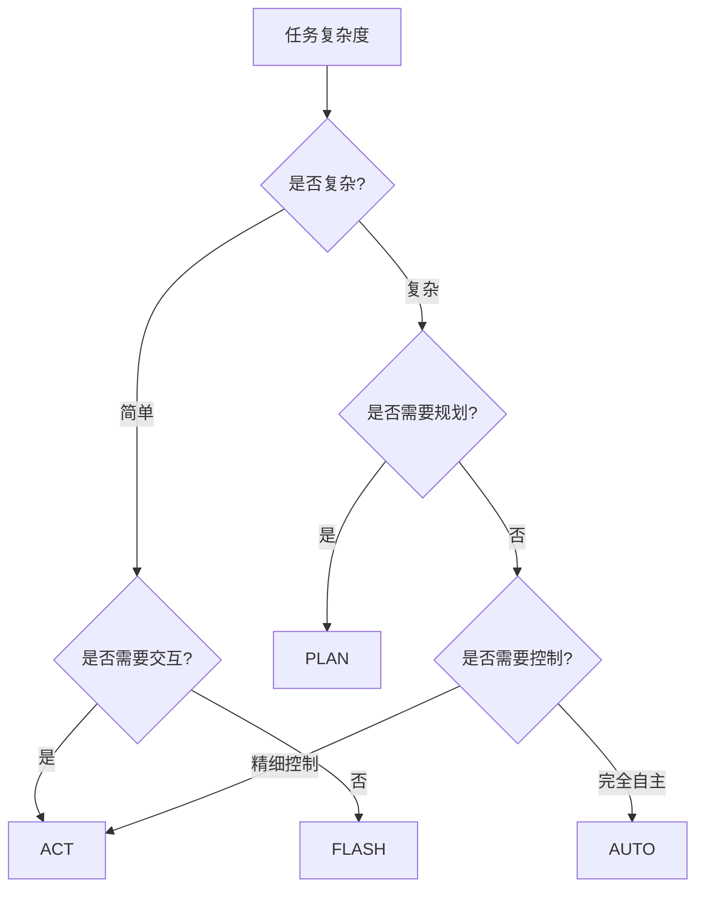

# 四种运行模式详解

## 1. 模式概述

TransMAgent 提供四种运行模式（ReAct Mode），用于控制 Agent 的执行策略。这些模式与三种 Agent 模式（BaseAgent/TransAgent/MultiAgent）可以自由组合。

### 1.1 模式速查表

| 模式 | 交互频率 | 自主程度 | 速度 | 推荐场景 |
|------|---------|---------|------|---------|
| **AUTO** | 低 | 高 | ⭐⭐⭐ | 复杂多步骤任务 |
| **ACT** | 高 | 低 | ⭐⭐ | 需要用户把关 |
| **PLAN** | 中 | 中 | ⭐⭐⭐⭐ | 需要先规划 |
| **FLASH** | 无 | 最高 | ⭐⭐⭐⭐⭐ | 快速简单任务 |

---

## 2. AUTO 模式（自动模式）

### 2.1 核心特点

**完全自主执行**，Agent 独立完成所有推理和操作，不向用户询问任何信息。

### 2.2 约束规则

```
1. ABSOLUTE AUTONOMY
   → 禁止询问任何信息、澄清或确认
   → 包括：缺失数据、工具选择、文件路径、环境配置

2. SELF-RELIANT EXPLORATION
   → 必须主动使用工具检查环境
   → 如果信息缺失，自己推断或假设

3. FORCE COMPLETION
   → 必须独立解决所有歧义
   → 遇到错误必须自我修正，不能暂停

4. ZERO INTERRUPTION
   → 从头到尾不间断执行
   → 不等待用户确认
```

### 2.3 工作流程

```
开始 → Think → Action → Observation → Think → ... → 完成
```

### 2.4 使用示例

```
用户: "帮我创建一个数据分析项目"

Agent (AUTO模式):
1. 创建项目目录结构
2. 编写数据清洗脚本  ← 独立决定
3. 创建可视化代码    ← 独立决定
4. 生成 README      ← 独立决定
5. 返回完成报告

[全程不询问用户]
```

### 2.5 适用场景

- ✅ 清晰明确的多步骤任务
- ✅ 探索性数据分析
- ✅ 代码批量生成
- ❌ 不适合：需要用户决策的任务

---

## 3. ACT 模式（行动模式）⭐ 重要修正

### 3.1 核心特点

**高度交互式执行**，与 AUTO 模式功能一致，但更注重与用户的实时交互。

> ⚠️ **重要说明**：ACT 模式与 AUTO 模式的核心推理逻辑相同，区别在于交互频率和用户参与程度。

### 3.2 约束规则

```
1. ZERO ASSUMPTIONS
   → 禁止猜测任何缺失信息
   → 遇到任何隐含、缺失或模糊的信息，必须立即暂停

2. GRANULAR EXECUTION  
   → 不要串接长流程
   → 每执行一个主要操作后，报告结果给用户
   → 必须等待用户明确确认后再继续

3. EXPLICIT ESCALATION
   → 遇到错误，不要自行修正
   → 必须展示错误日志，提出解决路径
   → 必须询问用户下一步指示

4. CONFIRM DESTRUCTION
   → 执行任何文件删除、覆盖、系统修改
   → 执行任何高成本 API 调用
   → 必须先获得用户明确授权
```

### 3.3 工作流程

```
用户请求 → [暂停询问] → 用户确认 → 执行一步 
→ [报告结果] → [暂停询问] → 用户确认 → 执行一步 
→ ... → 完成
```

### 3.4 使用示例

```
用户: "帮我创建一个数据分析项目"

Agent (ACT模式):
[Step 1] 分析任务...
请问：
1. 项目放在哪个目录？
2. 使用 Python 还是 R？
3. 数据文件在哪里？

用户: /home/user, Python, ./data.csv

[Step 2] 创建目录结构...
完成！目录已创建：
- data/
- scripts/
- output/

是否继续创建数据清洗脚本？

用户: 继续

[Step 3] 编写脚本...
...

[遇到错误]
抱歉，执行出错：
Error: File not found: ./data.csv

请问如何处理？
1. 使用示例数据继续
2. 取消任务
3. 手动指定数据路径
```

### 3.5 适用场景

- ✅ 需要用户参与决策的任务
- ✅ 重要文件/系统的修改
- ✅ 高风险操作（如删除、覆盖）
- ✅ 新用户或不熟悉的领域
- ✅ 合规性要求高的任务

### 3.6 AUTO vs ACT 对比

| 方面 | AUTO | ACT |
|------|------|-----|
| 推理逻辑 | 相同 | 相同 |
| 信息缺失处理 | 自行假设 | 立即询问 |
| 执行流程 | 不间断 | 逐步确认 |
| 错误处理 | 自我修正 | 报告给用户 |
| 用户参与 | 低 | 高 |
| 适用经验 | 高级用户 | 所有用户 |

---

## 4. PLAN 模式（计划模式）

### 4.1 核心特点

**先研究规划，再执行**，Agent 先进行深入研究和计划制定，用户确认后再执行。

### 4.2 约束规则

```
1. INVESTIGATIVE READ-ONLY
   → 禁止创建/修改文件
   → 禁止执行系统修改操作
   → 但鼓励阅读、搜索、调研

2. LIMITED TOOL ACCESS
   → 可用：只读工具（文件查看、网页搜索）
   → 禁用：任何修改系统状态的操作

3. MANDATORY CONSULTATION
   → 必须使用 ask_user 询问澄清问题
   → 讨论研究发现
   → 验证假设

4. ARCHITECT ROLE
   → 专注讨论、研究、规划
   → 获得明确批准后，才输出详细执行计划
   → 最后输出普通文本，不要用 ask_user

5. HANDOVER
   → 计划完成后，必须提示用户切换到执行模式
```

### 4.3 工作流程

```
用户请求 → 研究阶段（只读）→ 规划讨论 → 用户确认
→ 输出执行计划 → 提示切换模式
```

### 4.4 使用示例

```
用户: "帮我重构这个项目"

Agent (PLAN模式):

[研究阶段]
1. 阅读现有代码结构
2. 分析依赖关系
3. 搜索最佳实践

[规划讨论]
已完成初步分析，发现：
- 项目使用 Express.js
- 存在循环依赖问题
- 建议拆分为微服务

请问：
1. 重构目标是性能还是可维护性？
2. 是否有截止日期？
3. 测试覆盖率要求？

用户: 可维护性，1个月，80%

[输出计划]
根据讨论，制定如下执行计划：

Phase 1: 分析（1周）
- 完整代码审查
- 依赖图谱绘制

Phase 2: 重构（3周）
- 模块拆分
- 接口标准化
- 测试补充

Phase 3: 集成（1周）
- 集成测试
- 性能基准

请切换到 AUTO 或 ACT 模式开始执行。
```

### 4.5 适用场景

- ✅ 复杂项目的初始化
- ✅ 需要多方确认的任务
- ✅ 技术方案评审
- ✅ 新领域的探索性任务

---

## 5. FLASH 模式（闪速模式）

### 5.1 核心特点

**极简执行**，跳过所有冗余步骤，直接给出答案。

### 5.2 约束规则

```
1. RUTHLESS AUTONOMY
   → 不暂停询问
   → 不请求确认
   → 快速做出决策

2. MAXIMUM VELOCITY
   → 执行最直接的技术路径
   → 优先速度而非深度探索
   → 跳过边缘情况处理

3. SILENT EXECUTION
   → 最小化对话文字
   → 不输出步骤解释
   → 只输出最终结果

4. NO OVERHEAD
   → 禁止生成 Mermaid 图表
   → 禁止生成分解列表
   → 禁止生成冗长总结
```

### 5.3 工作流程

```
用户请求 → 快速推理 → 直接执行 → 输出结果
```

### 5.4 使用示例

```
用户: "1+1等于多少？"

Agent (FLASH模式):
2

---

用户: "翻译 hello 为中文"

Agent (FLASH模式):
你好

---

用户: "给我写一个打印 Hello World 的代码"

Agent (FLASH模式):
```python
print("Hello World")
```
```

### 5.5 适用场景

- ✅ 简单问答
- ✅ 快速代码片段
- ✅ 即时翻译
- ✅ 格式转换
- ❌ 不适合：复杂任务

---

## 6. 模式选择指南

### 6.1 决策流程



### 6.2 场景推荐

| 场景 | 推荐模式 |
|------|---------|
| 快速问答 | FLASH |
| 翻译/格式化 | FLASH |
| 简单代码 | FLASH / ACT |
| 需要确认的文件修改 | ACT |
| 重要系统操作 | ACT |
| 复杂多步骤任务 | AUTO |
| 全新项目规划 | PLAN |
| 技术方案讨论 | PLAN |
| 探索性研究 | AUTO / PLAN |

---

## 7. 模式组合示例

### 7.1 BaseAgent + AUTO
```
场景：批量代码生成
→ 完全自主执行，快速完成任务
```

### 7.2 TransAgent + ACT
```
场景：重要数据分析
→ 每步确认，保证数据完整性
```

### 7.3 MultiAgent + PLAN → AUTO
```
场景：大型项目开发
→ PLAN 阶段制定计划
→ AUTO 阶段执行计划
```

### 7.4 BaseAgent + FLASH
```
场景：日常快速问答
→ 极简响应，立即获得答案
```

---

## 8. 下一步

- 查看 `07_TOOLS_USAGE.md` 了解具体工具使用
- 查看 `08_FAQ.md` 常见问题解答
