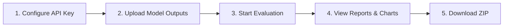

# 🧠 Eval Agent Web

> Multi-Model AI Agent Benchmarking Platform · 10-Dimension Automated Evaluation

**Eval Agent Web** is a Flask-based web application for benchmarking and comparing AI Agent outputs across multiple models. It leverages an LLM-as-a-Judge architecture to evaluate agent responses on **10 standardized dimensions**, producing publication-ready visualizations and downloadable reports.

---

## ✨ Features

| Feature | Description |
|---------|-------------|
| 📂 **Multi-format Upload** | Supports model result JSON (`transagent_result_test_set` format) and generic CSV/JSON |
| 🔟 **10-Dimension Scoring** | Automated evaluation across Data Authenticity, Response Relevance, Tool Use Accuracy, Hallucination Control, Code Execution, Domain Knowledge, Result Interpretation, Autonomous Planning, Error Recovery, and Output Standardization |
| 📡 **Real-time SSE Progress** | Server-Sent Events stream live evaluation progress to the frontend |
| 📊 **Visualization Reports** | Auto-generates model comparison bar charts, dimension heatmaps, and radar charts (PDF) |
| ⏸️ **Checkpoint Resume** | Interrupted evaluations can resume from the last saved checkpoint |
| 📦 **One-click Export** | Download all evaluation results, charts, and reports as a ZIP archive |
| 🧪 **Built-in Examples** | Includes sample data (3 models × 5 bioinformatics tasks) for immediate testing |
| 🔌 **OpenAI-compatible API** | Works with DeepSeek, GPT, and any OpenAI-compatible endpoint |

---

## 📋 Requirements

- **Python** ≥ 3.10
- **API Key** for an OpenAI-compatible LLM service (e.g., [DeepSeek](https://platform.deepseek.com))

---

## 🚀 Quick Start

```bash
# 1. Clone or enter the directory
cd eval_agent_web

# 2. Install dependencies
pip install -r requirements.txt

# 3. Start the server
python app.py
```

Open **[http://localhost:5000](http://localhost:5000)** in your browser.

---

## 🖥️ Usage Workflow



### Step 1 — API Configuration

Enter your OpenAI-compatible API endpoint and key. Default endpoint is `https://api.deepseek.com`.

> 💡 Click **🔑 Test Connection** to verify your API credentials before starting.

### Step 2 — Data Upload

Upload one or more model output files. Two formats are supported:

| Format | Description | Example |
|--------|-------------|---------|
| **Model JSON** | `transagent_result_test_set` format, one file per model | `GPT-4o.json`, `Claude-3.5.json` |
| **Generic CSV/JSON** | Custom column-mapped tabular data | Single file containing all models |

> 📁 You can also try the built-in examples immediately via the **📥 Load Examples** button.

### Step 3 — Evaluation

Click **🚀 Start Evaluation**. The system will:

1. Parse and normalize your uploaded data
2. Send each task to the LLM judge for 10-dimension scoring
3. Stream progress in real-time via SSE

### Step 4 — Results

After completion, you will see:

- **📊 Model Performance Comparison Chart** (bar chart, PDF)
- **🔥 Dimension Heatmap** (cross-model × cross-dimension, PDF)
- **🎯 Radar Comparison Chart** (multi-model overlay, PDF)
- **📝 Full Evaluation Report** (Markdown with per-task detail)

### Step 5 — Export

Click **📥 Download All** to get a ZIP containing all charts, reports, and raw statistics.

---

## 📊 Evaluation Dimensions

| # | Dimension | What It Measures |
|---|-----------|-----------------|
| 1 | **Data Authenticity** | Whether the response uses real data (not fabricated) |
| 2 | **Response Relevance** | How well the response addresses the given task |
| 3 | **Tool Use Accuracy** | Correctness of tool selection and parameter usage |
| 4 | **Hallucination Control** | Absence of fabricated facts or references |
| 5 | **Code Execution** | Quality and correctness of generated code |
| 6 | **Domain Knowledge** | Depth of bioinformatics/transcription regulation expertise |
| 7 | **Result Interpretation** | Clarity and accuracy of biological interpretation |
| 8 | **Autonomous Planning** | Quality of task decomposition and workflow design |
| 9 | **Error Recovery** | Ability to detect and recover from errors |
| 10 | **Output Standardization** | Compliance with structured output formats |

Each dimension is scored on a **0–10 scale** by the LLM judge.

---

## 🧱 Project Structure

```
eval_agent_web/
├── app.py                  # Flask application entry point (port 5000)
├── requirements.txt        # Python dependencies
├── core/
│   ├── __init__.py
│   ├── evaluator.py        # LLM evaluation engine + CheckpointManager
│   ├── parser.py           # Multi-format data parser (JSON/CSV)
│   ├── report.py           # Markdown report generator
│   └── visualizer.py       # Matplotlib chart generator (PDF)
├── templates/
│   └── index.html          # Web UI frontend
├── static/
│   ├── css/style.css       # Stylesheet
│   └── js/main.js          # Frontend logic (upload, SSE, charts)
├── examples/               # Sample model output files
│   ├── GPT-4o.json
│   ├── Claude-3.5.json
│   └── Gemini-Pro.json
├── tests/                  # Unit tests
├── uploads/                # Uploaded file storage (auto-created)
└── outputs/                # Evaluation results (auto-created)
```

---

## 🔧 Configuration

### Environment Variables

| Variable | Description | Default |
|----------|-------------|---------|
| `FLASK_HOST` | Server bind address | `0.0.0.0` |
| `FLASK_PORT` | Server port | `5000` |
| `MAX_CONTENT_LENGTH` | Max upload size | `200 MB` |

### API Compatibility

The evaluator uses the OpenAI Python SDK. Set the `api_url` to any compatible endpoint:

- **DeepSeek**: `https://api.deepseek.com`
- **OpenAI**: `https://api.openai.com/v1`
- **Local (Ollama/vLLM)**: `http://localhost:8000/v1`

---

## 🧪 Running Tests

```bash
cd eval_agent_web
pip install pytest
pytest tests/ -v
```

---

## 📄 License

This project is part of the [TransMAgent](https://github.com/TOSTRING-Z/TransMAgent) ecosystem and is licensed under the MIT License.
