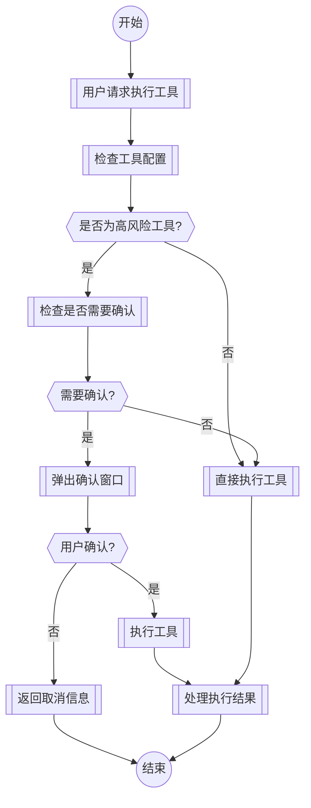

# 高风险工具执行确认功能实现总结

## 项目概述
在TransMAgent项目中实现了高风险工具执行确认功能，当用户在执行模式下调用高风险工具时，系统会弹出确认窗口要求用户确认。

## 实现功能

### 1. 高风险工具配置参数
- 在工具配置中添加了以下字段：
  - `high_risk`: 标记是否为高风险工具
  - `require_confirmation`: 控制是否需要确认
  - `confirmation_message`: 自定义确认消息

### 2. 工具配置界面修改
- 在工具配置界面添加了高风险选项
- 支持高风险工具标记和确认设置
- 界面显示高风险工具标签

### 3. 确认执行窗口组件
- 创建了`ConfirmationWindow`类
- 设计了确认窗口前端界面
- 支持确认请求和响应处理

### 4. 工具执行流程集成
- 在`ToolCall.ts`的`step`方法中添加确认逻辑
- 高风险工具：`cli_execute`, `python_execute`, `write_to_file`, `replace_in_file`
- 支持工具配置检查
- 统一工具执行结果处理

## 执行流程



## 修改的文件

### 1. 后端文件
- `src/backend/src/main/windows/WindowManager.ts` - 集成确认窗口
- `src/backend/src/main/windows/ConfirmationWindow.ts` - 创建确认窗口类
- `src/backend/src/main/windows/confirmation.html` - 确认窗口前端界面
- `src/backend/src/core/ToolCall.ts` - 集成确认逻辑到工具执行流程

### 2. 前端文件
- `src/backend/src/main/windows/tool.html` - 修改工具配置界面
- `src/backend/src/main/windows/tool.js` - 添加高风险选项处理逻辑

## 技术要点

### 1. 高风险工具检测
```typescript
const highRiskTools = ['cli_execute', 'python_execute', 'write_to_file', 'replace_in_file'];
const isHighRiskTool = highRiskTools.includes(this.toolInfo.tool);
```

### 2. 确认逻辑集成
```typescript
if (isHighRiskTool && this.window?.confirmationWindow) {
    // 显示确认窗口
    this.window.confirmationWindow.show({
        message: confirmationMessage,
        onConfirm: async () => {
            // 用户确认后执行工具
            let observation = await this.act(this.toolInfo);
            this.handleToolObservation(observation);
        },
        onCancel: () => {
            // 用户取消处理
        }
    });
    return; // 等待用户确认或取消
}
```

### 3. 统一结果处理
创建了`handleToolObservation`方法统一处理工具执行结果，避免代码重复。

## 测试结果
- 高风险工具正确检测
- 确认窗口逻辑正常
- 工具执行流程完整
- 用户取消处理正确

## 注意事项
1. 仅在高风险工具执行时弹出确认窗口
2. 支持工具配置自定义确认消息
3. 保持与现有工具执行流程兼容
4. 确保前后端通信正常